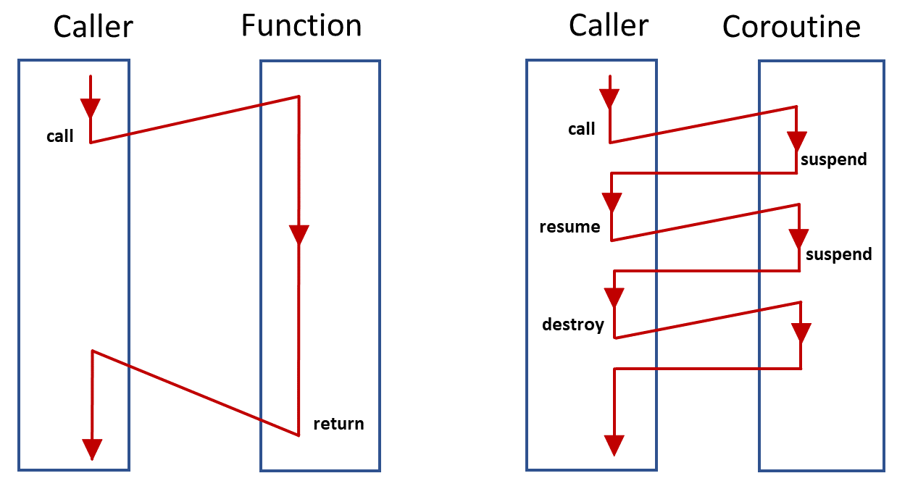

# Coroutines

Генераторы позволяют отправлять данные из генератора в родительскую рутину и получать их из родительской рутины.

Корутины могут управлять тем, где продолжат свое выполнение после `yield`, но генератор может передавать управление только обратно родительской рутине откуда он был вызван. Такие корутины называются **semi-corutines**.

С помощью генераторов в пхп можно реализовать **совместную многозадачность** — несколько сопрограмм могут передавать управление друг другу, каждая сопрограмма решает сама, когда она передает управление другой сопрограмме. Таким образом, можно без использования многопоточности выполнять несколько независиммых задач в одном потоке выделяя на каждую задачу какое-то время и затем переключиться на другую задачу.



В пхп для реализации совместной многозадачности нужно создать собственый обработчик задач - https://habr.com/ru/post/164173/

Механизм обеспечивается с помошью метода `send` генератора, который позволяет отправлять данные в генератор и получать их из генератора:

```php

function gen() {
    $ret = (yield 'yield1');
    var_dump($ret);
    $ret = (yield 'yield2');
    var_dump($ret);
}

$gen = gen();
var_dump($gen->current());    // string(6) "yield1"
var_dump($gen->send('ret1')); // string(4) "ret1"   (the first var_dump in gen)
                              // string(6) "yield2" (the var_dump of the ->send() return value)
var_dump($gen->send('ret2')); // string(4) "ret2"   (again from within gen)
                              // NULL               (the return value of ->send())
```

## Links
- https://habr.com/ru/post/164173/ — реализация корутин на пхп
- https://www.slideshare.net/chtalbert/from-generator-to-fiber-the-road-to-coroutine-in-php — слайд по корутинам, генераторам и файберам
