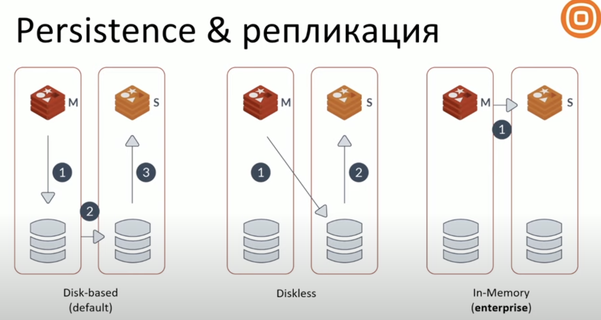

# Redis

Redis - `in-memory` хранилище в формате `key-value` .

## Преимущества

**Легкий и Быстрый**. 
Малый вес приложения (меньше 10 мб) и малое потребление оперативной памяти (меньше 3 мб пустой инстанс).
1М записей занимает меньше 100 МБ.
Более 1М операций в секунду.

**Множество структур данных.**
**Низкий порог входа**

Основные сферы применения:
- Кэширование
- Хранилище сессий
- Работа с очередями
- Блокировки (mutex)

## Использование

### Cache
Redis чаще всего используют как хранилище для кэша.

TTL - влияет на производительность. Если много небольших ключей, то это будет влиять на потребление памяти
Удаление ключей происходит при обращении или случайным образом (редис раз в несколько секунд проходит по случайным ключам и проверяет не нужно ли их удалить).

## Logging

В высоконагруженных сервисах прямая запись логов в файл может быть очень долгой. 

## Metrics

В высоконагруженных сервисах может быть много метрик которые необходимо собирать

## Транзакции

Ядро редиса однопоточно. Это значит что транзакции всегда выполняются последовательно. Транзакции атомарны и не могут быть откачены (rollback)

Redis поддерживает Lua скрипты. Они также выполняются атомарно. Аналог хранимых процедур.

## Репликация

Редис поддерживает мастер-слейв репликацию. 
Синхронизация работает следующим образом: на мастере делается форк процесса мастера и данные копируются на машину слейва.
В случае если редису было выделено больше половины оперативной памяти на машине (настройка **maxmemory**) и произошел полный рассинхрон со слейвом (например перезапуск сервера), то возникнет ошибка с переполнением памяти.

## Настройки

### Links
- https://habr.com/ru/companies/wunderfund/articles/685894/ - подробная статья о редис
- https://redis.io/ - официальный сайт и документация
- https://www.youtube.com/watch?v=JBIm4sglyQU - доклад по редису на Highload++, немного хардкорный
- https://www.youtube.com/watch?v=AimUYjKs3pQ&t=270s - базовая практика редис с обзором основных возможностей