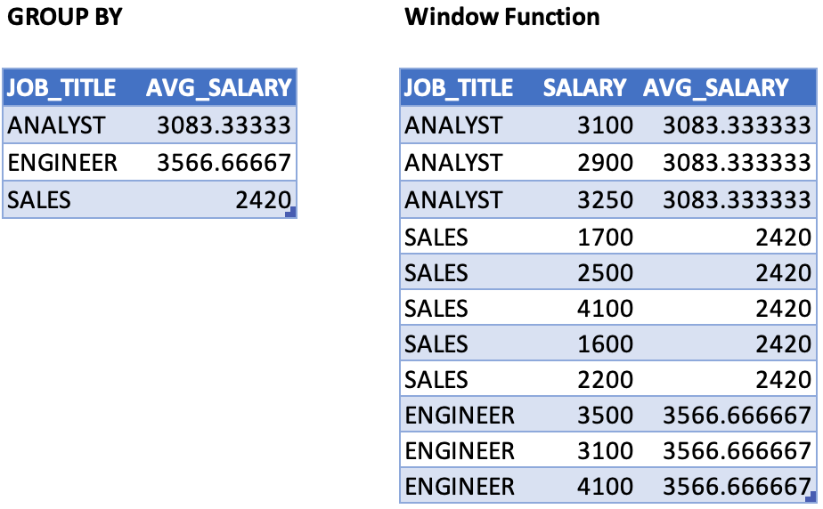
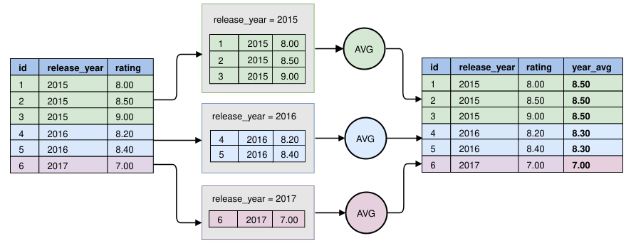
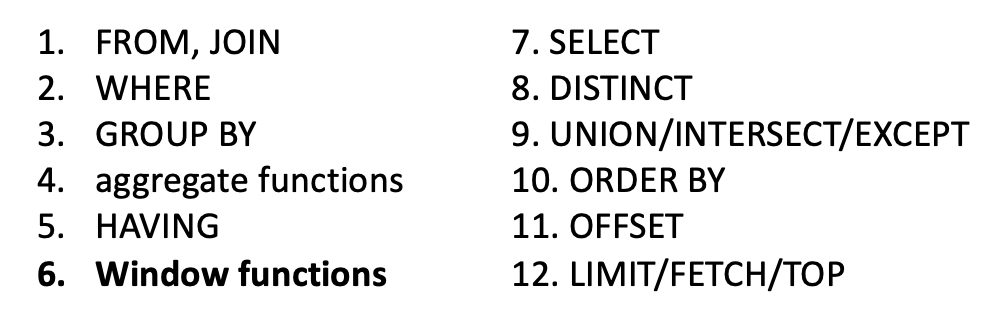
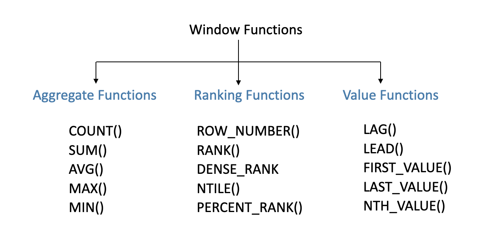
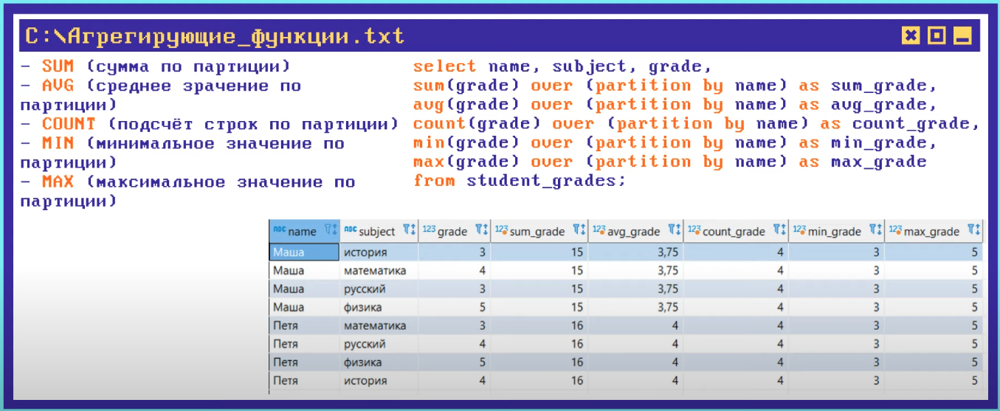
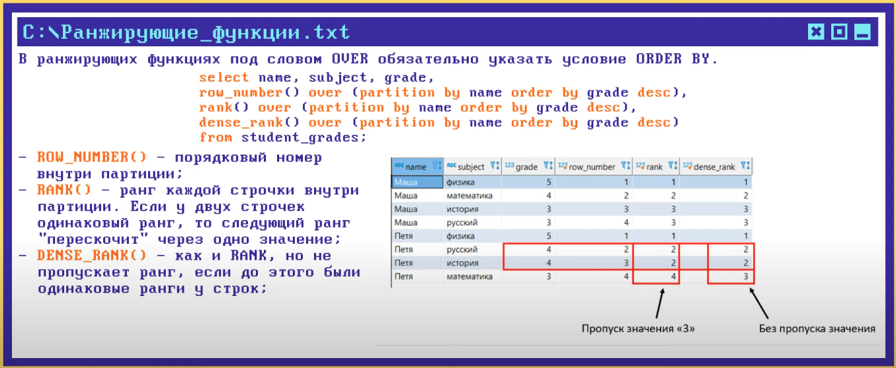
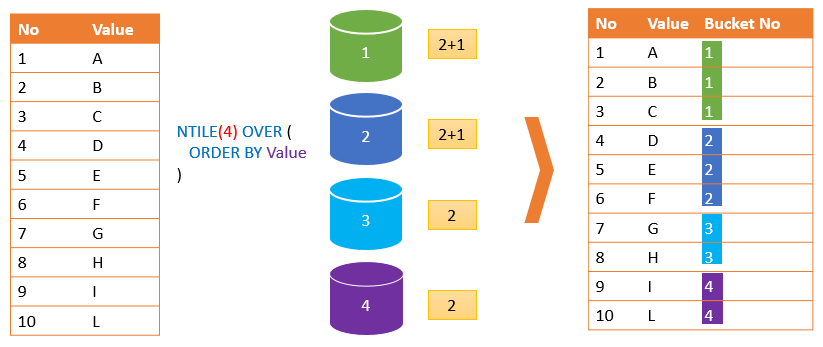
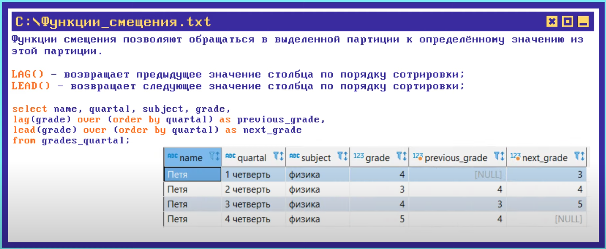

# Window functions

**Агрегационные функции** схлопывают результат в одну строку по группе. **Оконные функции** позволяют не схлопывать данные. Вместо этого они работают с выделенным набором строк (партиция, окно, фрейм).



## Синтаксис

Синтаксис вызова оконной функции:
```
function_name ([expression [, expression ... ]]) [ FILTER ( WHERE filter_clause ) ] OVER window_name

function_name ([expression [, expression ... ]]) [ FILTER ( WHERE filter_clause ) ] OVER ( window_definition )
```

Синтиксис определения оконной функции:
```
[ existing_window_name ]
[ PARTITION BY expression [, ...] ]
[ ORDER BY expression [ ASC | DESC | USING operator ] [ NULLS { FIRST | LAST } ] [, ...] ]
[ frame_clause ]
```

Существует 2 вида вызова оконной функции:<br/>
Inline в SELECT:
```sql
SELECT city, month, 
  sum(sold) OVER (
    PARTITION BY city 
    ORDER BY month 
    RANGE UNBOUNDED PRECEDING) total
FROM sales;
```

В случае если нужно несколько вызов одной оконной функции в одном запросе, объявление функции выносится в конец запроса после group by/having и перед order/limit:
```sql
SELECT country, city,
  rank() OVER country_sold_avg
FROM sales
WHERE month BETWEEN 1 AND 6
GROUP BY country, city
HAVING sum(sold) > 10000
WINDOW country_sold_avg AS (
  PARTITION BY country 
  ORDER BY avg(sold) DESC)
ORDER BY country, city;
```


## Партицирование

Партицирование производится либо по какой-то колонке (`release_year`) или же по всему результирующему набору данных.



## Порядок выполнения оконных функций
Оконные функции выполняются после группировки и аргегационных функций и перед сортировкой и limit.



## Классы оконных функций



**Агрегирующие функции**<br/>


**Ранжирующие функции**<br/>


**Ntile** делит партицию на равные части:<br/>


**Функции смещения**<br/>



## TODOs
- Что если я хочу отфильтровать результат оконной функции по какому-то значению? Нельзя делать where по результату оконной функции
- Можно ли в одной оконной функции использовать результат другой оконной функции?
- cume_dist
- partition by несколько полей

## LINKS:
- Большой крутой чит шит https://learnsql.com/blog/sql-window-functions-cheat-sheet/
