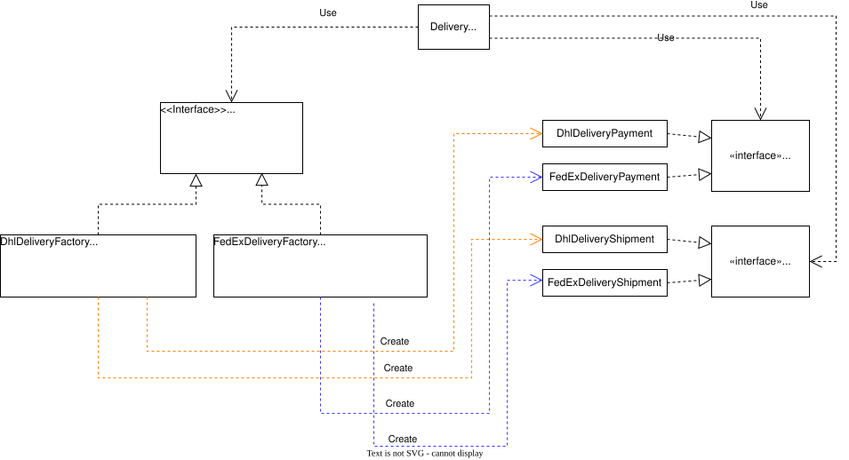
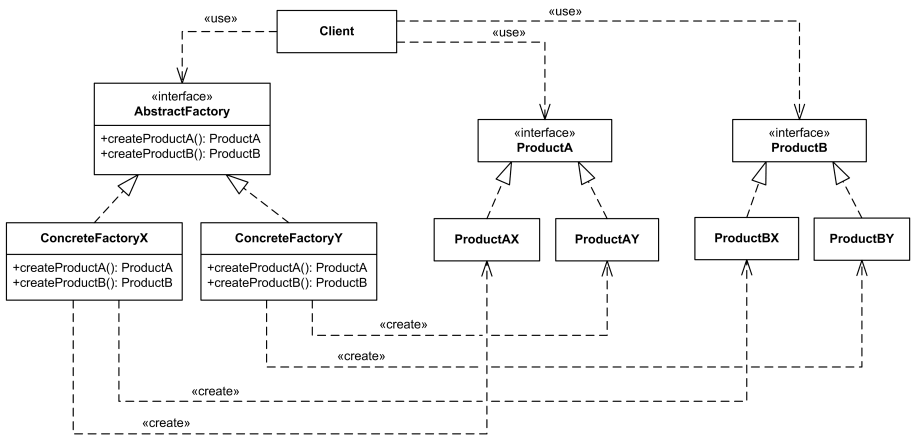

# Abstract Factory

Порождающий шаблон проектирования, который используется в ситуациях, когда необходимо абстрагировать инстанцирование семейства связанных объектов.

**Пример**: Существует процесс доставки товаров (*Delivery*). Этот процесс включает в себя оплату (*Payment*) и отправку (*Shipment*) по месту назначения (за это отвечают разные классы). Существует 2 шипмент метода - *DHL* и *FedEx*.

Таким образом, имеем семейство связанных классов *Shipment* и *Payment*, связанных по общей логической сущности *Delivery*. При этом сам *Delivery* может быть типа *DHL* и *FedEx*

Тогда получим 2 конкретные фабрики для *DHL* и *FedEx*, которые пораждают конкретные реализации *Shipment* и *Payment*.

**Delivery UML**


**General UML**



```php

//Интерфейс абстрактной фабрики
interface DeliveryFactory
{
    //методы для порождения семейства связанных объектов
    //в данном случае в доставке у нас есть оплата и сам метод доставки
    public function getPayment(): Payment;
    public function getShipment(): Shipment;
}

//Эти интерфейсы будет использовать клиентский код
interface Payment
{
    public function pay(): bool;
}

//Эти интерфейсы будет использовать клиентский код
interface Shipment
{
    public function sendPackage(): bool;
}

//Конкретная фабрика для семейства объектов для DHL доставки
class DhlDeliveryFactory implements DeliveryFactory
{
    public function getPayment(): Payment
    {
        return new DhlDeliveryPayment();
    }

    public function getShipment(): Shipment
    {
        return new DhlDeliveryShipment();
    }
}

//Конкретная фабрика для семейства объектов для FedEx доставки
class FedExDeliveryFactory implements DeliveryFactory
{
    public function getPayment(): Payment
    {
        return new FedExDeliveryPayment();
    }

    public function getShipment(): Shipment
    {
        return new FedExDeliveryShipment();
    }
}

//Конкреные классы спецефичные для каждого вида доставки
class DhlDeliveryPayment implements Payment
{
    public function pay(): bool
    {
        return true;
    }
}

//Конкреные классы спецефичные для каждого вида доставки
class FedExDeliveryPayment implements Payment
{
    public function pay(): bool
    {
        return true;
    }
}

//Конкреные классы спецефичные для каждого вида доставки
class DhlDeliveryShipment implements Shipment
{
    public function sendPackage(): bool
    {
        return true;
    }
}

//Конкреные классы спецефичные для каждого вида доставки
class FedExDeliveryShipment implements Shipment
{
    public function sendPackage(): bool
    {
        return true;
    }
}

//Клиентский класс, который управляет процессом доставки
class Delivery
{
    private DeliveryFactory $factory;

    //Принимает параметром конкретную фабрику по интерфейсу
    public function __construct(DeliveryFactory $factory)
    {
        $this->factory = $factory;
    }

    public function makePayment(): bool
    {
        $payment = $this->factory->getPayment();
        return $payment->pay();
    }

    public function ship(): bool
    {
        $shipment = $this->factory->getShipment();
        return $shipment->sendPackage();
    }
}

//Клиентский код. По какой-то логике выбираем нужную конкретную фабрику
//и передаем ее в клиентский класс, в котором и будут порождаться необходимые сущности

$dhlDeliveryFactory = new DhlDeliveryFactory();
$delivery = new Delivery($dhlDeliveryFactory);

if ($delivery->makePayment()) {
    $delivery->ship();
}
```
