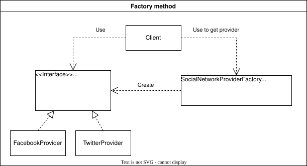

# Factory Method

Порождающий шаблон, который используется для абстрагирования процесса инстанцирования объектов общего супертипа.

**Пример**: клиентский код работает с провайдерами социальных сетей *SocialNetworkProvider*. Существует 2 конкретных провайдера - *FacebookProvider* и *TwitterProvider*. Фабрика *SocialNetworkProviderFactory* предоставляет метод для инстанцирования провайдеров на основе входящего параметра *$type* и возвращает объект супертипа *SocialNetworkProvider*

**UML диаграмма**


```php
<?php

//Интерфейс объектов, которые порождаются фабрикой
interface SocialNetworkProvider
{
    public function signIn(): string;
    public function signUp(): string;
}

//Конкретный класс провайдера
class FacebookProvider implements SocialNetworkProvider
{
    public function signIn(): string
    {
        //some auth process
        $token = 'eyJhbGciOiJIUzI1NiIsInR5cCI6IkpXVCJ9';
        return $token;
    }

    public function signUp(): string
    {
        //some auth process
        $token = 'eyJhbGciOiJIUzI1NiIsInR5cCI6IkpXVCJ9';
        return $token;
    }
}

//Конкретный класс провайдера
class TwitterProvider implements SocialNetworkProvider
{
    public function signIn(): string
    {
        //some auth process
        $token = 'eyJhbGciOiJIUzI1NiIsInR5cCI6IkpXVCJ9';
        return $token;
    }

    public function signUp(): string
    {
        //some auth process
        $token = 'eyJhbGciOiJIUzI1NiIsInR5cCI6IkpXVCJ9';
        return $token;
    }
}

//Класс фабрики
class SocialNetworkProviderFactory
{
    const TYPE_FACEBOOK = 'facebook';
    const TYPE_TWITTER = 'twitter';

    /**
     * Метод который инстанцирует объект типа SocialNetworkProvider конкретного класса
     * 
     * @param $type
     * @return SocialNetworkProvider
     * @throws Exception
     */
    public static function getProvider($type): SocialNetworkProvider
    {
        switch ($type) {
            case self::TYPE_TWITTER:
                return new TwitterProvider();
            case self::TYPE_FACEBOOK:
                return new FacebookProvider();
            default:
                throw new Exception('unsupported type');
        }
    }
}

//Клиентский код использует фабрику для инстанцирования объектов конкретного типа супертипа SocialNetworkProvider
$socialNetworkProvider = SocialNetworkProviderFactory::getProvider(SocialNetworkProviderFactory::TYPE_FACEBOOK);
$socialNetworkProvider->signIn();
```
