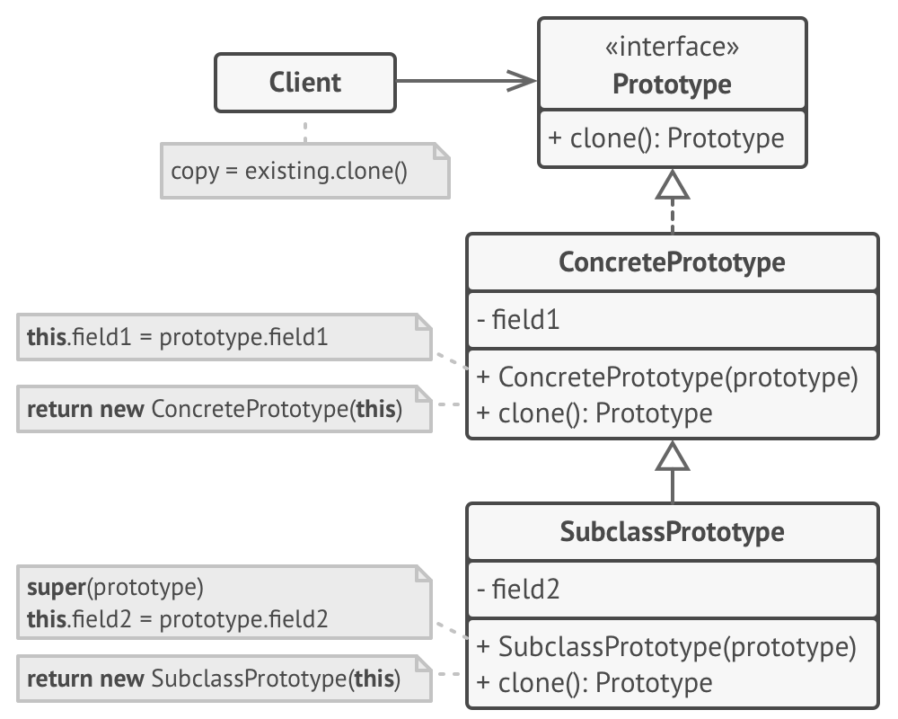

# Prototype

Предоставляет клиентскому коду метод для клонирования объекта. Обеспечивается это методом clone реализованным в классе объект которого необходимо клонировать

В php есть ключевое слово clone с помощью которого можно сделать поверхностную копию объектов. Поверхностная значит, что если какое-то поле объекта является ссылкой на другой объект, то это поле в склонированном объекте будет ссылкой на тот же объект. С помощью магического метода *\_\_clone* можно реализовать необходимую логику для клонирования вложенных объектов
