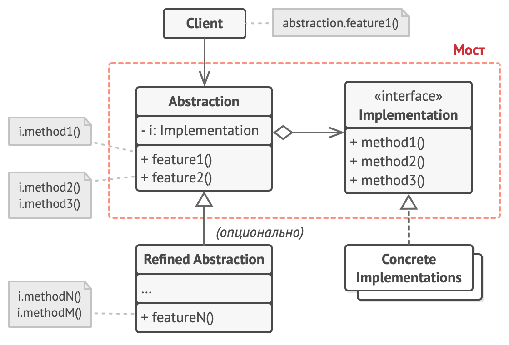

# Bridge

Паттерн позволяет разбить большой класс/сложную иерархию на несколько независимых иерархий, которые можно разрабатывать независимо друг от друга.



**Пример**: существует класс отчета. Отчет может быть сформирован в формате PDF, JSON, HTML. Также отчет имеет различия для отделов Accounting, Management, Employee.
При использовании наследования пришлось бы создавать отдельный конкретный класс для каждой комбинации (AccountingPDFReport, ManagementHTMLReport и тд)

При использовании моста эту иерархию можно разбить на 2 независимых - иерархия отчетов для отделов, иерархия форматов отчетов.

**Abstraction** - базовый класс *Report*
**Refined Abstraction** - подклассы *AccountingReport*, *ManagementReport*, *EmployeeReport*
**Implementation** - интерфейс *ReportFormatter*
**Concrete Implementation** - Конкретные форматтеры для отчетов: *PDFReportFormatter*, *JsonReportFormatter* и тд

```php

/**
 * Абстракция.
 */
abstract class Report
{
    /**
     * @var ReportFormatter
     */
    protected $formatter;

    /**
     * Обычно Абстракция инициализируется одним из объектов Реализации.
     */
    public function __construct(ReportFormatter $formatter)
    {
        $this->formatter = $formatter;
    }

    /**
     * Паттерн Мост позволяет динамически заменять присоединённый объект
     * Реализации.
     */
    public function changeFormatter(ReportFormatter $formatter): void
    {
        $this->formatter = $formatter;
    }

    /**
     * Поведение «вида» остаётся абстрактным, так как оно предоставляется только
     * классами Конкретной Абстракции.
     */
    abstract public function create(): string;
}

/**
 * Эта Конкретная Абстракция создаёт отчет для бухгалтерии.
 */
class AccountingReport extends Report
{
    public function __construct(ReportFormatter $formatter)
    {
        parent::__construct($formatter);
    }

    public function create(): string
    {
        return $this->formatter->createDocument($this->getReportData());
    }

    public function getReportData(): array
    {
        //специфичные для AccountingReport данные
        return [];
    }
}

/**
 * Эта Конкретная Абстракция создаёт отчет для сотрудников.
 */
class EmployeeReport extends Report
{
    public function __construct(ReportFormatter $formatter)
    {
        parent::__construct($formatter);
    }

    public function create(): string
    {
        return $this->formatter->createDocument($this->getReportData());
    }

    public function getReportData(): array
    {
        //специфичные для EmployeeReport данные
        return [];
    }
}


/**
 * Реализация объявляет набор «реальных», «под капотом», «платформенных»
 * методов.
 *
 */
interface ReportFormatter
{
    public function createDocument(array $data): string;
}

/**
 * Эта Конкретная Реализация формирует отчет в формате PDF.
 */
class PDFReportFormatter implements ReportFormatter
{
    public function createDocument(array $data): string
    {
        return "pdf document binary";
    }
}

/**
 * Эта Конкретная Реализация формирует отчет в формате HTML.
 */
class HTMLReportFormatter implements ReportFormatter
{
    public function createDocument(array $data): string
    {
        return "html report";
    }
}

/**
 * Клиентский код имеет дело только с объектами Абстракции.
 */
function clientCode(Report $report)
{
    // ...

    echo $report->create();

    // ...
}

/**
 * Клиентский код может выполняться с любой предварительно сконфигурированной
 * комбинацией Абстракция+Реализация.
 */
$PDFReportFormatter = new PDFReportFormatter();
$HTMLReportFormatter = new HTMLReportFormatter();

$report = new AccountingReport($PDFReportFormatter);
clientCode($report);

$report = new EmployeeReport($HTMLReportFormatter);
clientCode($report);

```
