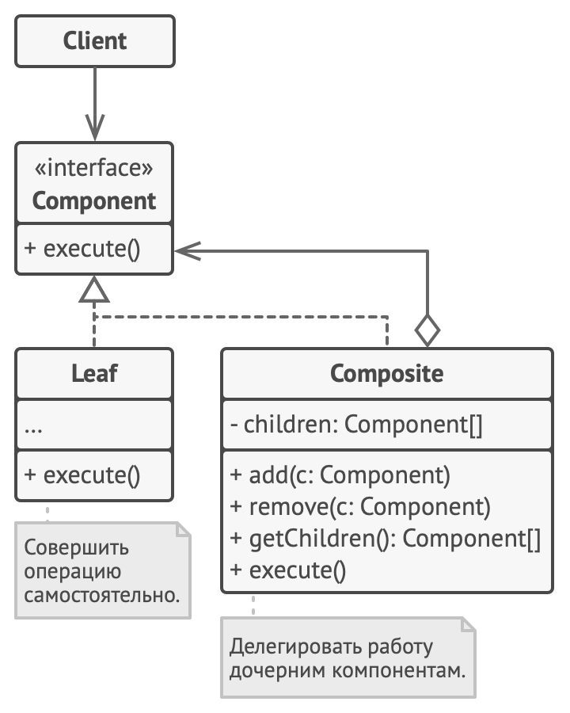

# Composite

Позволяет организовать древовидную структуру и работать с ней как с единым объектом.

Композит состоит из объектов двух типов - *Composite* и *Leaf*. *Composite* является контенером для объектов *Leaf*. "Полезная нагрузка" в основном будет находится в объектах *Leaf*. *Composite* и *Leaf* имеют одинаковый интерфейс *Component* что позволяет обрабатывать *Composite* и *Leaf* единообразно.



**Пример**: сборка сложного заказа как в гелато. Может быть несколько разных коробок с печатной продукцией со вложенностью. Композит позволяет сконфигурировать такой заказ и определить его общую стоимость, вес, объем.

```php
/**
 * Базовый класс Компонент объявляет интерфейс для всех конкретных компонентов,
 * как простых, так и сложных.
 *
 * В нашем примере OrderItem может быть и конкретным продуктом и коробкой, в которую упаковывается продукт
 */
abstract class OrderItem
{
    protected int $weight;
    protected int $price;

    public function __construct(int $weight, int $price)
    {
        $this->weight = $weight;
        $this->price = $price;
    }

    abstract public function getTotalWeight(): int;
    abstract public function getTotalPrice(): int;
}

/**
 * Это компонент-Лист. Как и все Листья, он не может иметь вложенных
 * компонентов.
 */
class Product extends OrderItem
{
    private array $data;

    public function __construct(int $weight, int $price, array $data)
    {
        parent::__construct($weight, $price);
        $this->data = $data;
    }

    /**
     * Поскольку у компонентов-Листьев нет вложенных компонентов, которые могут
     * выполнять за них основную часть работы, обычно Листья делают большую
     * часть тяжёлой работы внутри паттерна Компоновщик.
     *
     * В этом примере сложной работы нет, но мог бы быть более сложный расчет цены или веса
     */
    public function getTotalWeight(): int
    {
        return $this->weight;
    }

    public function getTotalPrice(): int
    {
        return $this->price;
    }
}

/**
 * Контейнер реализует инфраструктуру для управления дочерними объектами
 */
class ProductComposite extends OrderItem
{
    /**
     * @var OrderItem[]
     */
    protected array $items = [];

    /**
     * Методы добавления подобъектов.
     */
    public function add(OrderItem $item): static
    {
        $this->items[] = $item;
        return $this;
    }

    /**
     * Вызывает метод подобъектов, и объединяет результат.
     * Листья также могут быть контейнерами
     */
    public function getTotalWeight(): int
    {
        $result = $this->weight;

        foreach ($this->items as $item) {
            $result += $item->getTotalWeight();
        }

        return $result;
    }

    public function getTotalPrice(): int
    {
        $result = $this->price;

        foreach ($this->items as $item) {
            $result += $item->getTotalPrice();
        }

        return $result;
    }
}

/**
 * Клиентский код.
 * Создадим все продукты и контейнеры
 */
$cards1 = new Product(10, 100, ['type' => 'a4_cards', 'amount' => 100]);
$cards2 = new Product(10, 100, ['type' => 'a4_cards', 'amount' => 100]);
$cardsBox = new ProductComposite(1, 5);

$flyer1 = new Product(20, 200, ['type' => 'a5_flyer', 'amount' => 200]);
$flyer2 = new Product(20, 200, ['type' => 'a5_flyer', 'amount' => 200]);
$flyer3 = new Product(30, 300, ['type' => 'a5_flyer', 'amount' => 300]);
$flyerBox = new ProductComposite(1, 5);

$orderBox = new ProductComposite(2, 10);

/**
 * Разместим все продукты и контейнеры по контейнерам 
 */

$cardsBox
    ->add($cards1)
    ->add($cards2);

$flyerBox
    ->add($flyer1)
    ->add($flyer2)
    ->add($flyer3);

$orderBox
    ->add($cardsBox)
    ->add($flyerBox);

/**
 * Теперь можно работать с корневым контейнером и получать результаты для всего заказа
 */

$orderBox->getTotalPrice();
$orderBox->getTotalWeight();

```
