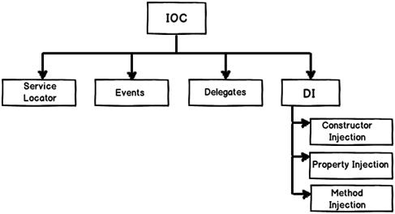

# Inversion of Control, Dependency Injection, DI Container

## Inversion of Control

В классических программах поток выполнения идет "сверху вниз". Т.е. разработчик начиная с точки входа управляет тем, в какой последовательности выполняются те или иные функции.

**Inversion of Control** это подход, при котором клиентский код (код, который пишет разработчик) встраивается в поток выполнения программы в особых местах. Этот подход широко используется в фреймворках и является основной отличительной характеристикой библиотеки от фреймворка.

Поток выполнения выглядит как:
Kernel init -> Config init -> Resolve controller -> **Client code** -> Response -> Shutdown

Таким образом **Client code** перехватывает поток управления в строго определенный фреймворком момент и затем вновь возвращает его фреймворку. **Фреймворк управляет кодом программиста, а не программист управляет фреймворком**, фреймворк предоствляет **коллбек** для клиентского кода

**Inversion of Control** это общий термин который содержит в себе разные подходы к реализации. Сам по себе принцип IoC используемый во фреймворке еще не обозначает, что фреймфорк предоставляет какой-то IoC механизм для клиентского кода (DI контейнер, например)



## Dependency injection

**Dependency injection pattern** является частным случаем реализации принципа **IoC**.
Паттерн служит для уменьшения зацепления классов (Coupling) путем включения функционала класса через внедрение в конструктор/сеттер/параметр, вместо использования наследования или прямого инстанцирования объекта внутри класса

**Нарушение принципа** - прямое инстанцирование
```php
class ReportHandler
{
    public function sendReport()
    {
        $db = new DB('root', 'root');
        $rows = $db->get('SELECT * FROM report;');

        $generator = new PDFReportGenerator();
        $report = $generator->generatePDF($rows);

        $mailer = new Mailer();

        $mailer->sendEmail(
            'mail@to.com',
            'Report email',
            'Report email',
            ['attachments' => [$report]]
        );
    }
}
```

**Соблюдение паттерна** - код, от которого зависит класс внедряется через параметры конструктора (однако тут все равно есть наружение принципа DIP, следует использовать интерфейсы и абстрагировать доступ до данных в базе)
```php
class ReportHandler
{
    private PDFReportGenerator $generator;
    private MysqlDB $db;
    private Gmailer $mailer;

    public function __construct(MysqlDB $db, PDFReportGenerator $generator, Gmailer $mailer)
    {
        $this->db = $db;
        $this->generator = $generator;
        $this->mailer = $mailer;
    }

    public function sendReport()
    {
        $rows = $this->db->get('SELECT * FROM report;');
        $report = $this->generator->generatePDF($rows);
        $this->mailer->sendEmail(
            'mail@to.com',
            'Report email',
            'Report email',
            ['attachments' => [$report]]
        );
    }
}

```

Для обеспечения работы этого паттрена нужна какая-то точка уровнем выше, в которой происходит создание (инстанцирование) и внедрение зависимостей. Такая точка называется **Composition Root**

## Dependency injection Container
**DI container** это библиотека/класс, который контролирует жизненный цикл и процесс инстанцирования объектов, которые будут использованы для внедрения зависимостей.

**Реализация** такого контейнера будет довольно сложной - необходимо использовать Reflection API для обеспечения инстанцирвоания зависимостей вместе с их зависимостями (дерево зависимостей), поддержка интерфейсов и конфигурации связи интерфейса с конкретной реализацией, кеширование дерева зависимотей и параметров и тд.

Существует **PSR-11**, который декларирует интерфейс для DI контейнера - https://www.php-fig.org/psr/psr-11/

Существуют реализации на PHP:
- https://github.com/PHP-DI/PHP-DI
- Laravel Service Container https://laravel.com/docs/9.x/container
- Symfony Service Container https://symfony.com/doc/current/service_container.html

### DI container example

Простой пример реализации DI контейнера - https://github.com/ggelashvili/learnphptherightway-project/tree/3.5

**Класс контейнера**
```php

declare(strict_types = 1);

namespace App;

use App\Exceptions\Container\ContainerException;
use App\Exceptions\Container\NotFoundException;
use Psr\Container\ContainerInterface;

class Container implements ContainerInterface
{
    private array $entries = [];

    public function get(string $id)
    {
        if ($this->has($id)) {
            $entry = $this->entries[$id];

            if (is_callable($entry)) {
                return $entry($this);
            }

            $id = $entry;
        }

        return $this->resolve($id);
    }

    public function has(string $id): bool
    {
        return isset($this->entries[$id]);
    }

    public function set(string $id, callable|string $concrete): void
    {
        $this->entries[$id] = $concrete;
    }

    public function resolve(string $id)
    {
        // 1. Inspect the class that we are trying to get from the container
        try {
            $reflectionClass = new \ReflectionClass($id);
        } catch(\ReflectionException $e) {
            throw new NotFoundException($e->getMessage(), $e->getCode(), $e);
        }

        if (! $reflectionClass->isInstantiable()) {
            throw new ContainerException('Class "' . $id . '" is not instantiable');
        }

        // 2. Inspect the constructor of the class
        $constructor = $reflectionClass->getConstructor();

        if (! $constructor) {
            return new $id;
        }

        // 3. Inspect the constructor parameters (dependencies)
        $parameters = $constructor->getParameters();

        if (! $parameters) {
            return new $id;
        }

        // 4. If the constructor parameter is a class then try to resolve that class using the container
        $dependencies = array_map(
            function (\ReflectionParameter $param) use ($id) {
                $name = $param->getName();
                $type = $param->getType();

                if (! $type) {
                    throw new ContainerException(
                        'Failed to resolve class "' . $id . '" because param "' . $name . '" is missing a type hint'
                    );
                }

                if ($type instanceof \ReflectionUnionType) {
                    throw new ContainerException(
                        'Failed to resolve class "' . $id . '" because of union type for param "' . $name . '"'
                    );
                }

                if ($type instanceof \ReflectionNamedType && ! $type->isBuiltin()) {
                    return $this->get($type->getName());
                }

                throw new ContainerException(
                    'Failed to resolve class "' . $id . '" because invalid param "' . $name . '"'
                );
            },
            $parameters
        );

        return $reflectionClass->newInstanceArgs($dependencies);
    }
}

```

**Router**. Тут с помощью DI контейнера происходит разрешение зависимостей контроллера
```php

declare(strict_types=1);

namespace App;

use App\Exceptions\RouteNotFoundException;

class Router
{
    private array $routes = [];

    public function __construct(private Container $container)
    {
    }

...

    public function resolve(string $requestUri, string $requestMethod)
    {
        $route = explode('?', $requestUri)[0];
        $action = $this->routes[$requestMethod][$route] ?? null;

        if (! $action) {
            throw new RouteNotFoundException();
        }

        if (is_callable($action)) {
            return call_user_func($action);
        }

        [$class, $method] = $action;

        if (class_exists($class)) {
            $class = $this->container->get($class);

            if (method_exists($class, $method)) {
                return call_user_func_array([$class, $method], []);
            }
        }

        throw new RouteNotFoundException();
    }
}

```

Точка входа приложения. Тут же находится **Composition Root** (конфигурация интерфейса и конкретного класса)
```php
declare(strict_types = 1);

namespace App;

use App\Exceptions\RouteNotFoundException;
use App\Services\PaymentGatewayService;
use App\Services\PaymentGatewayServiceInterface;

class App
{
    private static DB $db;

    public function __construct(
        protected Container $container,
        protected Router $router,
        protected array $request,
        protected Config $config
    ) {
        static::$db = new DB($config->db ?? []);

        $this->container->set(PaymentGatewayServiceInterface::class, PaymentGatewayService::class);
    }

    public static function db(): DB
    {
        return static::$db;
    }

    public function run()
    {
        try {
            echo $this->router->resolve($this->request['uri'], strtolower($this->request['method']));
        } catch (RouteNotFoundException) {
            http_response_code(404);

            echo View::make('error/404');
        }
    }
}
```

Видео версия с пояснениями:

- Dependency injection and DI container https://www.youtube.com/watch?v=igx3bIl1T_c&ab_channel=ProgramWithGio
- DI container with autowiring and reflection API https://www.youtube.com/watch?v=78Vpg97rQwE&ab_channel=ProgramWithGio
- DI container and interfaces https://www.youtube.com/watch?v=0YDRQbgHBO8&ab_channel=ProgramWithGio


## Links
- https://freecontent.manning.com/dependency-injection-in-net-2nd-edition-understanding-the-composition-root/
- https://habr.com/ru/post/465395/
- https://martinfowler.com/articles/injection.html#InversionOfControl
- https://stackoverflow.com/questions/6550700/inversion-of-control-vs-dependency-injection