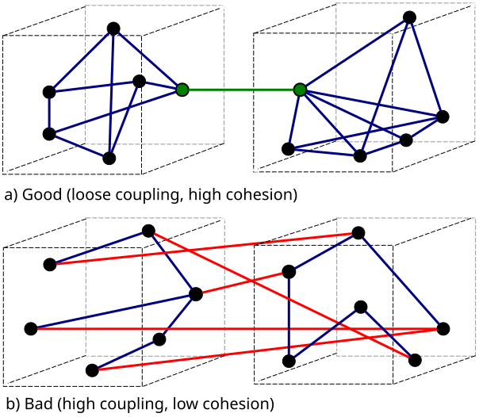
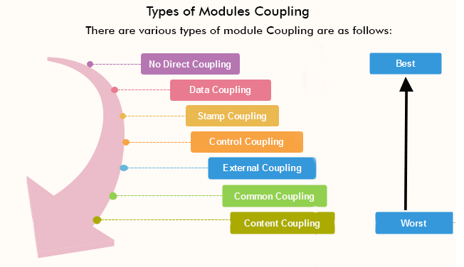
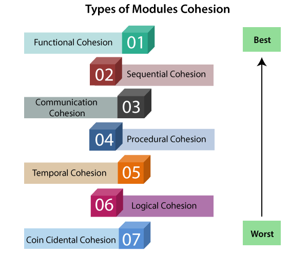
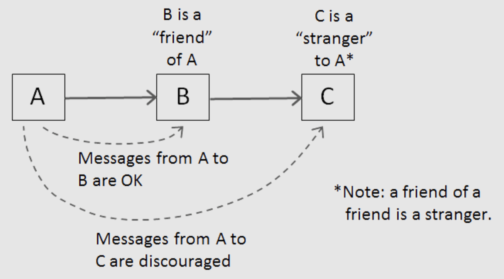

# GRASP

https://ru.wikipedia.org/wiki/GRASP

## Low Coupling и High Cohesion
Слабое **зацепление** (coupling) и высокая **связанность** (cohesion) - принцип проектирования дизайна ПО

### Coupling

Слабое **зацепление** (coupling) обозначает, что программные сущности (модули, классы) слабо связаны друг с другом - не имеют жестких ссылкок друг на друга, не используют общие данные, общие поля и тд

Существует несколько видов **зацепления** (coupling)

- **Сontent coupling**
Один модуль полагается на внутреннее устройство другого модуля. Изменения в одном неизбежно вызывают изменнения в другом
- **Common coupling**
Оба модуля работают с общими данными (например глобальная переменая)
- **External coupling**
Оба модуля используют общий формат данных, протокол связи и тд
- **Control coupling**
Один модуль управляет поведением другого
- **Stamp couplig**
Модули используют одну структуру данных, но только ее части (возможно даже разные части)
- **Data coupling**
Модули совместно используют данные, например, через параметры
- **Message coupling**
Модули общаются только через передачу параметров или сообщений
- **No coupling**
Нет зависимости между модулями

### Cohesion
Мера согласованности элементов программной сущности (модуля, класса). Если элементы программной сущности соотвествуют единой цели, то такая согласованность называется высокая **связаность** (**high cohesion**). Сфокусированность мадуля/класса

Существует несколько типов связанности (cohesion):

- **Coincidental cohesion**
Случайная связанность. Самая низкая мера связанности
- **Logical cohesion**
Части модуля относятся к одной проблеме
- **Temporal cohesion**
Части модуля используются в одно время, рядом
- **Procedural cohesion**
Части модуля используются всегда в одном и том же порядке
- **Communication cohesion**
Части модуля работают над одними и теми же данными
- **Sequential cohesion**
Результат работы одной части модуля является исходными данными для другой
- **Functional cohesion**
Части модуля направлены на решение одной конкретной задачи за которую отвечает модуль

## Закон Деметры

Принцип наименьшего знания - модуль может обращаться непосредственно к только к "друзьям" (модули связаны непосредственно) и не может обращаться напрямую "чужакам" (модули, с которыми опосредована связь через "друзей")
Т.е. вызов `$this->invoiceService->paymentService->getPaymentMethod()` нарушает закон Деметры

Этот принцип связан с принципом слабого **зацепления** (coupling)

## Links
- https://enterprisecraftsmanship.com/posts/cohesion-coupling-difference/
- https://ducmanhphan.github.io/2019-03-23-Coupling-and-Cohension-in-OOP/
- https://medium.com/german-gorelkin/low-coupling-high-cohesion-d36369fb1be9
- https://thevaluable.dev/cohesion-coupling-guide-examples/