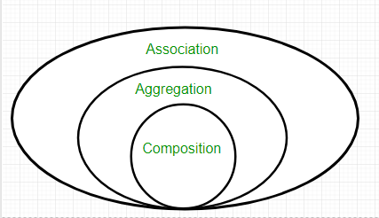

# Объектно-ориентированное программирование

## Понятие ООП

Здесь под ООП будет подразумеваться ООП основанное на классах (class-based programming, class-orientation). Это пояснение означает, что здесь не будет рассмотрено прототипно-ориентированное ООП (prototype-based programming) и модель акторов (actor model).

Понятие ООП впервые было введено Аланом Кеем в примерно 1969 году. Имеется письмо в котором Алан Кей рассказывает о том, как и когда эта идея появилась и какие понятия он вкладывал в ООП изначально.
Первым популярным ООП языком программирования стал Smalltalk, разработанный под руководством того же Алана Кея.

ООП появилось как развитие/замена процедурному программированию.
**Задача процедурного программирования** - разбить задачу на набор переменных, структур данных и подпрограмм. Модули/подпрограммы взаимодействуют посредствам чтения/модификации общедоступных данных. Код не связан с данными.
**Задача объектно-ориентированного программирования** - разбить задачу на объекты, которые предоставляют поведение и данные посредствам интерфейса. Данные связаны с кодом, который их обрабатывает, и только этот код имеет к ним доступ (данные инкапсулированы в объекте).

Таким образом, ООП, по сравнению с ПП, позволяет подняться на более высокий уровень абстракции, что позволяет разрабатывать более сложные, по структуре взаимодействий компонентов, приложения. Более того - ООП это не столько об использовании синтаксических возможностей языков с поддержкой ООП, сколько о мышлении в терминах объектов. Поэтому такие понятия как наследование и инкапсуляция следует рассматривать не с синтаксической точки зрения (наследование - повторяемость кода, инкапсуляция - сокрытие), а с семантической (наследование - полиморфизм подтипов, инкапсуляция - объединение данных и кода их обработки).

Основные принципы ООП, заложенные Аланом Кеем:
- Всё объект (в Smalltalk даже условные конструкции - объект)
- Объекты обмениваются информацией друг с другом посредствам посылки сообщений. Это не то же самое, что вызов метода. Например, в Objective-C, где реализован именно механизм отправки сообщений, если отправить сообщение, которое объект не может обработать, не будет сгенерировано исключение (в отличии от вызова несуществующего метода). Сообщения также являются объектом. 
- Объект является представителем класса, который выражает свойства объектов
- Поведение объекта задается его классом
- Классы организованы в единую древовидную структуру с общим корнем, называемую иерархией наследования

На данный момент не существует четкого общепринятого определения ООП, а принципы, указанные выше, подверглись существенному изменению или даже искажению. Этому способствовало то, что примерно с середины 1980-х годов термин “объектно-ориентированный” стал модным и его стали искусственно применять к любым новым разработкам, чтобы повысить их привлекательность.

Стоит также отметить, что один из 2-х, изначально самых важных, принципов ООП “посылка сообщения” (второй - “все объект”) практически не проявляется в современных принципах ООП. Концепция сообщений нашла свое развитие в модели акторов. Идея модели акторов является родственной идее ООП и наиболее похожа на идею ООП в ее изначальной трактовке - Джо Армстронг (создатель erlang) говорил, что считает Erlang единственным настоящим ООП языком.

На данный момент в ООП выделяют следующие основные принципы: абстракция, инкапсуляция, наследование и полиморфизм.

Из-за путанницы в определениях и принципах ООП, эта парадигма подвергается многочисленной критике и часто возникают холивары на тему того, что же на самом деле такое правильное ООП. Кроме того непонятно, как критиковать то, у чего нет конкретного и общепризнанного определения.

## Принципы ООП

### Абстракция

Выделение минимального набора полей и методов (характеристик) объекта, которые с достаточной точностью представляют его в данной системе. Абстракция отвечает за формирование публичного интерфейса класса и скрывает внутреннюю реализацию на этапе проектирования класса.


### Инкапсуляция

Инкапсуляция — это один из основных принципов ООП. Она представляет собой механизм, позволяющий скрыть внутренние детали объекта и предоставлять доступ к данным и методам объекта только через определенные интерфейсы. Это помогает защитить данные от некорректного использования и обеспечивает контроль над изменением состояния объекта.

У понятия инкапсуляция существует две трактовки:

**Семантически** это объединение данных и функций, которые управляют этими данными, в единый компонент. Инкапсуляцию можно представить как защитную оболочку, которая предохраняет код и данные от произвольного доступа из других кодов, определенных все этой оболочки. Инкапсуляция позволяет скрывать детали реализации логики и работать с объектом, как с единой сущностью. А если клиентский код не знает ничего, кроме публичного интерфейса, то он не может зависеть от деталей реализации.

**Синтаксически** это механизм языка, позволяющий ограничить доступ одних компонентов программы к другим. Это определение ближе к термину сокрытие, которое может и не быть обеспечено механизмами языка программирования. Инкапсуляция != сокрытие. Кроме того эта трактовка не передает идею принципа дизайна класса, которая вложена в семантическое определение.

Основные аспекты:

**Сокрытие данных:** Инкапсуляция позволяет скрыть внутреннее состояние объекта от внешнего мира. Данные объекта становятся доступными только через методы, предоставленные самим объектом.
**Контроль доступа:** Внутренние данные и методы объекта могут быть объявлены как приватные (private) или защищенные (protected), что предотвращает их прямой доступ из кода вне объекта. Публичные методы (public) используются для взаимодействия с объектом.
**Целостность данных:** Поскольку доступ к данным осуществляется через методы, можно контролировать и проверять изменения состояния объекта, что помогает поддерживать его целостность и корректность.

Преимущества:

**Безопасность:** Инкапсуляция защищает внутреннее состояние объекта от непреднамеренных или злонамеренных изменений.
**Гибкость:** Изменения внутренней реализации объекта не влияют на внешний код, который использует объект. Это облегчает поддержку и обновление кода.
**Упрощение отладки:** Локализация изменений и проверок состояния объекта в пределах класса облегчает отладку и тестирование кода.


### Наследование
https://habr.com/ru/post/325478/
https://habr.com/ru/post/354046/
https://ru.stackoverflow.com/questions/235352/%D0%9E%D1%82%D0%BB%D0%B8%D1%87%D0%B8%D1%8F-%D0%B0%D0%B1%D1%81%D1%82%D1%80%D0%B0%D0%BA%D1%82%D0%BD%D0%BE%D0%B3%D0%BE-%D0%BA%D0%BB%D0%B0%D1%81%D1%81%D0%B0-%D0%BE%D1%82-%D0%B8%D0%BD%D1%82%D0%B5%D1%80%D1%84%D0%B5%D0%B9%D1%81%D0%B0-abstract-class-and-interface

Наследование можно рассматривать с двух точек зрения:
- **Семантически** наследование устанавливает связь типа “is a” и отождествляется с полиморфизмом подтипов;
- **Синтаксически** наследование предоставляет возможность повторного использования кода.

Наследование следует использовать для формирования иерархии родственных объектов, обеспечивая полиморфизм.
В качестве способа повторного использования кода можно использовать агрегацию и композицию.

##### Абстрактный класс и интерфейс - чем отличаются и когда нужно выбрать одно, а когда другое?

Различия с синтаксической точки зрения:
- Во многих языках запрещено множественное наследование, но позволено реализовывать множество интерфейсов
- В абстрактном классе могут быть поля и могут быть методы с описаной логикой, в том числе конструктор
- Абстрактный класс может быть использован как механизм повторного использования кода

С точки зрения ОО дизайна, абстрактный класс следует использовать в тех случаях, когда существует отношение **является** - *JsonResponse* **is** *Response*.
Интерфейс, в свою очередь, является контрактом и декларирует **что может делать** объект - *Response* **can be** *Serializable* (serialize, unserialize), а также *Stringable* (toString)

https://stackoverflow.com/questions/479142/when-to-use-an-interface-instead-of-an-abstract-class-and-vice-versa

##### Предпочитайте композицию наследованию

> Prefer composition over inheritance as it is more malleable / easy to modify later, but do not use a compose-always approach.

Следует использовать **наследование**, если подклассу требуется раскрывать все/множество публичных методов родительского класса. Т.е. если при композиции потребуется создавать множество прокси методов. В целом, наследованию будет соответсвовать тип связи **is a**. Также наследование будет походить в случае, когда в клиетском коде потребуется соблюдение принципа Барбары Лисков для рассматриваемых объектов

Однако использование наследования в случае типа связи  **is a** также не всегда хороший индикатор. Например, в системе может быть 2 класса - *StripePayment* и *PaypalPayment*. Похоже, что оба они являются подтипами супертипа *Payment*. Но когда в системе появятся *CryptoPayment* и *MobilePayment* с другим набором методов и другим флоу оплаты, то наследование создаст множество проблем - нужно делать заглушки для неиспользуемых методов и раскрывать новые методы которых нет в супертипе. Кроме того, принцип LSP не будет соблюден в данном случае, т.к. сам клиентский код для обработки процесса платежа будет различаться в зависимости от типа платежа

https://stackoverflow.com/questions/49002/prefer-composition-over-inheritance
https://www.youtube.com/watch?v=djd9zdlzyuA&ab_channel=ProgramWithGio

##### Ассоциация, Композиция, Агрегация, Делегирование

https://stackoverflow.com/questions/1384426/distinguishing-between-delegation-composition-and-aggregation-java-oo-design



**Ассоциация** обозначает тип связи между объектами в ОО системах. Выделяют 2 типа ассоциации - композиция и агрегация

###### Композиция

Тип отношение в котором жизненный цикл одного объекта полностью контролируется другим. Объект полностью зависим от другого и не может существовать самостоятельно


```php
class SendmailTransport implements TransportInterface
{
    private SmtpTransport $transport;

    public function __construct()
    {
        $this->transport = new SmtpTransport();
    }
}
```

###### Агрегация

Жизненные циклы объектов независимы. Один объект хранит ссылку на другой в своем поле и использует по надобности


```php
class Mailer
{
    private TransportInterface $transport;
    
    public function __construct(TransportInterface $transport)
    {
        $this->transport = $transport;
    }
    
    public function send()
    {
        $this->transport->send();
    }
}
```

###### Делегирование

Объекты независимы друг от друга. Один объект вызывает метод другого объекта, но не хранит в себе на него ссылки. Не считается типом ассоциации


```php
class Request
{
    public function logRequest(LoggerInterface $logger)
    {
        $logger->log($this->reqestHeader, $this->requestBody);
    }
}
```

### Полиморфизм

Общее понятие можно выразить как способность алгоритма использовать разные типы данных.
Понятие полиморфизм можно разделить на 3 основные категории:

#### Ad-hoc полиморфизм
“Специальный” полиморфизм. Реализуется с помощью перегрузки методов. Для разных типов данных существует отдельная реализация (метод).

```
int add(int a, int b) {
    return a + b;
}
```

```
float add(float a, float b) {
    return a + b;
}
```

#### Параметрический полиморфизм
Понятие из функционального программирования. Здесь подразумевается, что один и тот же код может быть выполнен для разных типов данных. В объектно-ориентированных языках программирования ограниченной формой параметрического полиморфизма является обобщенное программирование (generics).

#### Полиморфизм подтипов
Это понятие обозначает, что параметрически полиморфная функция ограничена параметрами, которые находятся в иерархии “супертип”-”подтип”. 

Т.е. клиентский код может использовать интерфес и ему не требуется знать с каким конкретно классом он работает.

Данный тип полиморфизма достигается в объектно-ориентированных языках посредствам семантического наследования (наследование базового класса или реализация интерфейса).


## Links

- Письмо Алана кея с пояснениями по ООП http://userpage.fu-berlin.de/~ram/pub/pub_jf47ht81Ht/doc_kay_oop_en 
- Интервью с Девидом Уэстом (автор Object Thinking), “Классы - это не объектно” https://jug.ru/2016/09/bugayenko-west/
- Джо Армстронг (Создатель Erlang) на тему ООП, ФП, Erlang и Elixir https://habr.com/ru/post/450508/
- Модель акторов и ООП https://en.wikipedia.org/wiki/Actor_model#Fundamental_concepts
- ООП Холивар 1 (комменты) https://habr.com/ru/post/451982/
- ООП Холивар 2 (комменты) https://habr.com/ru/post/452462/
- Дэвид Уэст, Object Thinking https://www.ozon.ru/context/detail/id/1830970/
- Принципы ООП быдло-языком https://www.youtube.com/watch?v=BHNt1fcg8iw
