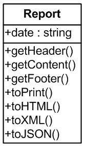
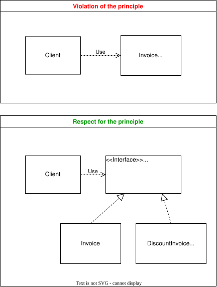
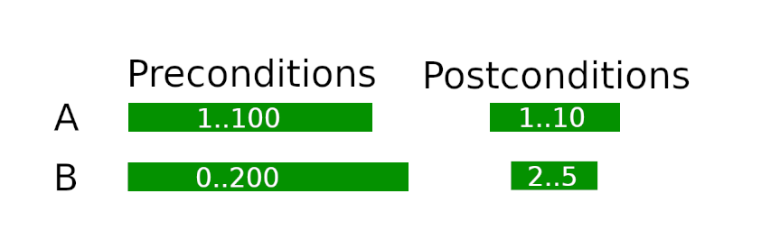
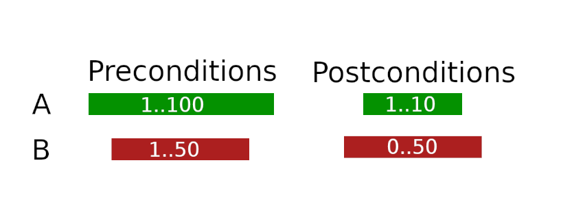
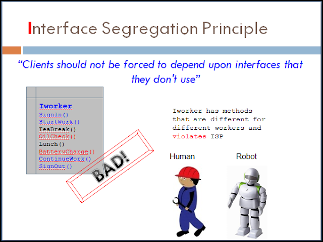
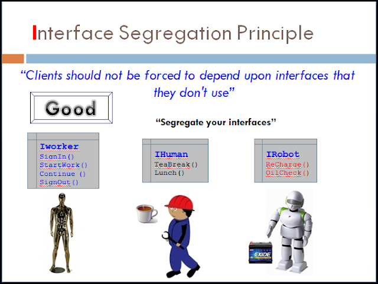

# SOLID

Набор принципов разработки ОО-приложений направленный на управление сложностью кода (понимание, поддержка, гибкость, пригодность для рафакторинга)
Эти принципы были собраны и сформулированы Робертом Мартином (дядя Боб)

## SRP - Single responsibility principle (Принцип единственной ответственности)
Для каждого класса должно быть определено одно единственное назначение.
Т.е. это обозначает, что у каждого класса должна быть только одна причина для его изменения.

Например, есть класс, который формирует и печатает отчет:



 Для такого класса существует 2 причины для изменения:
- изменился сам отчет
- изменился формат отчета

Таким образом такой класс нарушает SRP.

SRP не должен применяться фанатично и может быть нарушен, если это не влечет за собой увеличение сложности разработки и поддержки кода.

Примеры нарушения принципа:
- god object
- active record (зависит от реализации)

## OCP - Open–closed principle (Принцип открытости/закрытости)

> Программные сущности должны быть закрыты для изменения, но открыты для расширения.

- открыты для расширения: означает, что поведение сущности может быть расширено путём создания новых типов сущностей.
- закрыты для изменения: в результате расширения поведения сущности, не должны вноситься изменения в код, который эту сущность использует.

В современном понимании это обозначает (на примере):
Существует класс *Invoice*, в нем есть метод *printPdf*. Есть *Client* code который его использует. Допустим, для определенного случая понадобилось добавить в PDF документ дополнительный блок с суммой скидки. 

Тогда **нарушение** этого принципа может выглядеть как добавление в метод *Invoice::printPdf* дополнительного параметра *discount* и измение кода метода для отрисовки блока

**Соблюдение** принципа будет выглядеть так:
*Client* code изначально использует не класс *Invoice*, а интерфейс *InvoiceInterface*. Создается новый класс *DiscountInvoice* (может наследоваться или агрегировать *Invoice*) и уже в нем описывается новая требуемая логика для блока со скидкой



Преимущества соблюдения принципа:
- Клиентский код и используемый класс не требуют изменений. Таким образом уже протестированый и отладенный код не будет затронут при внесении изменений

Недостатки использования принципа:
- Softcoding

Принцип стоит использовать в случае, когда кандидат на изменение - очень часто используемый класс в большом проекте с множеством разработчиков


## LSP - Barbara Liskov substitution principle (Принцип подстановки Барбары Лисков)

> Наследующий класс должен дополнять, а не замещать поведение базового класса.

У принципа LSP есть две основных формулировки:
- Работа программы не должна изменяться в зависмости от того, используется ли базовый класс или же один из его наследников
- Входные параметры подкласса не могут иметь более жесткие требования, чем в суперклассе И возвращаемые значения подкласса не могут иметь более мягкие (широкие, вольные, weakened) требования, чем в суперклассе (**предусловия** и **постусловия**)

**Пример**:
Метод суперкласса A принимает значения 1..100, а возвращает 1..10
Тогда метод подкласса B может принимать значения 0..200 и возвращать 2..5
**НО** метод подкласса B **НЕ** может принимать значения 1..50 и возвращать 0..50




Т.е. детали реализации суперкласса и подкласса не должны влиять на то, как клиентский код работает с этими классами - клиентский код не должен пытаться раскрыть какой конкретный класс перед ним.

Сигнатура интерфейса накладывает ограничение на наследование на синтаксическом уровне, а LSP накладывает ограничение на уровне логики/реализации.

Т.е. дочерний класс может расширить входные параметры функции необязательными параметрами, но не должен добавлять что-то к возвращаемому значению.

**Пример:**
Существует класс *File* с методом *save(\$path)*. Если создается наследник *DocumentFile* с методом save(\$path, \$flag), то параметр flag должен быть необязателен со значением по умолчанию.
Если в базовом методе *save* класса *File* возвращаемые значения = \[SUCCESS, FAIL\], то в *DocumentFile* не могут возврщаться другие флаги, например \[SUCCESS, FAIL, PROCESSING\], однако количество флагов может быть сокращено 


#### Covariance and contravariance

Термины ковариатность и контрвариантность могут быть применены к обобщениям (например, templates/ delagates в C#) или к параметрам и возвращаемым значениям в PHP

Ковариантность совпадает с направлением наследования
Контрвариантность обратна направлению наследования

PHP поддерживает ковариантность к контрвариантность в версиях >= 7.4

- PHP поддерживает **ковариантность** в **возвращаемых значениях**. Это значит, что метод переопределенный в наследнике может возвращать более конкретное значение (Базовый метод *render* возвращает *Image*, наследник возвращает *JpegImage*, более спецефичный)
- PHP поддерживает **контрвариантность** в **параметрах методов**. Это значит, что метод переопределенный в наследнике может принимать более общее значение, чем задекларированно в родителе (базовый метод *render* принимает *InvoiceDocument*, наследник может принимать *Document*)

Обратное в PHP не позволено, т.е. синтаксически поддерживается принцип Барбары Лисков

```php

abstract class DocumentProcessor
{
    public function render(InvoiceDocument $document) {
        $image = new Image();
        return $image;
    }
}

class JpegDocumentProcessor extends DocumentProcessor
{
    //Контрвариантность входного параметра, может принимать более общий класс
    public function render(Document $document) {
        
        //Ковариантность возвращаемого значения, может возвращать более спецефичный класс
        $image = new JpegImage();
        return $image;
    }
}
```


https://habr.com/ru/post/559724/
https://www.php.net/manual/ru/language.oop5.variance.php
https://www.youtube.com/watch?v=AgSrOI7N-fU&ab_channel=ProgramWithGio


## ISP - Interface segregation principle (Принцип разделения интерфейса)
Лучше много узкоспециализированных интерфейсов, чем один общего назначения.
Перекликается с **принципом единственной отвественности**

Клиентский код должен знать только о тех методах, которые ему требуются. Тогда изменение интерфейса (т.е. когда он не "толстый") не потребует множества изменений по клиентскому коду.




## DIP - Dependency inversion principle (Принцип инверсии зависимостей)

-   Модули верхних уровней не должны зависеть от модулей нижних уровней. Оба типа модулей должны зависеть от абстракций.
-   Абстракции не должны зависеть от деталей. Детали должны зависеть от абстракций.

**Нарушение принципа** - модуль верхнего уровня зависит от модулей нижнего уровня и их деталей
```php
class ReportHandler
{
    private PDFReportGenerator $generator;
    private MysqlDB $db;
    private Gmailer $mailer;

    public function __construct(MysqlDB $db, PDFReportGenerator $generator, Gmailer $mailer)
    {
        $this->db = $db;
        $this->generator = $generator;
        $this->mailer = $mailer;
    }

    public function sendReport()
    {
        $rows = $this->db->get('SELECT * FROM report;');
        $report = $this->generator->generatePDF($rows);
        $this->mailer->sendEmail(
            'mail@to.com',
            'Report email',
            'Report email',
            ['attachments' => [$report]]
        );
    }
}

```

Соблюдение принципа - модуль вехнего уровня зависит только от абстракций (интерфейсов). *ReportRepository* абстракция над слоем данных (не важно какой там провайдер - база даных или файловая система, etc)
```php

class ReportHandler
{
    private ReportRepository $repository;
    private ReportGeneratorInterface $generator;
    private NotificationService $notificationService;
    private ConfigurationInterface $config;

    public function __construct(
        ReportRepository $repository,
        ReportGeneratorInterface $generator,
        NotificationService $notificationService,
        ConfigurationInterface $config
    ) {
        $this->repository = $repository;
        $this->generator = $generator;
        $this->notificationService = $notificationService;
        $this->config = $config;
    }

    public function sendReport()
    {
        $reportModelList = $this->repository->getReportList();
        $report = $this->generator->generate(
            $reportModelList,
            $this->config->get('report.format')
        );

        $this->notificationService->send(
            $this->config->get('report.notification.type'),
            $this->config->get('report.notification.to'),
            $this->config->get('report.notification.text'),
            [
                'attachments' => [$report]
            ]
        );
    }
}
```

### Links
- https://stackify.com/solid-design-principles/
