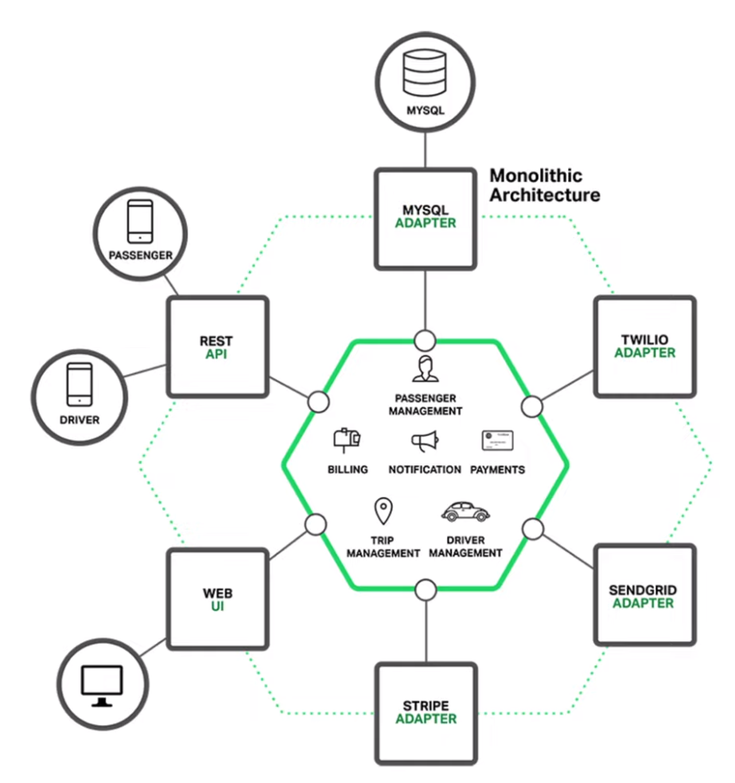
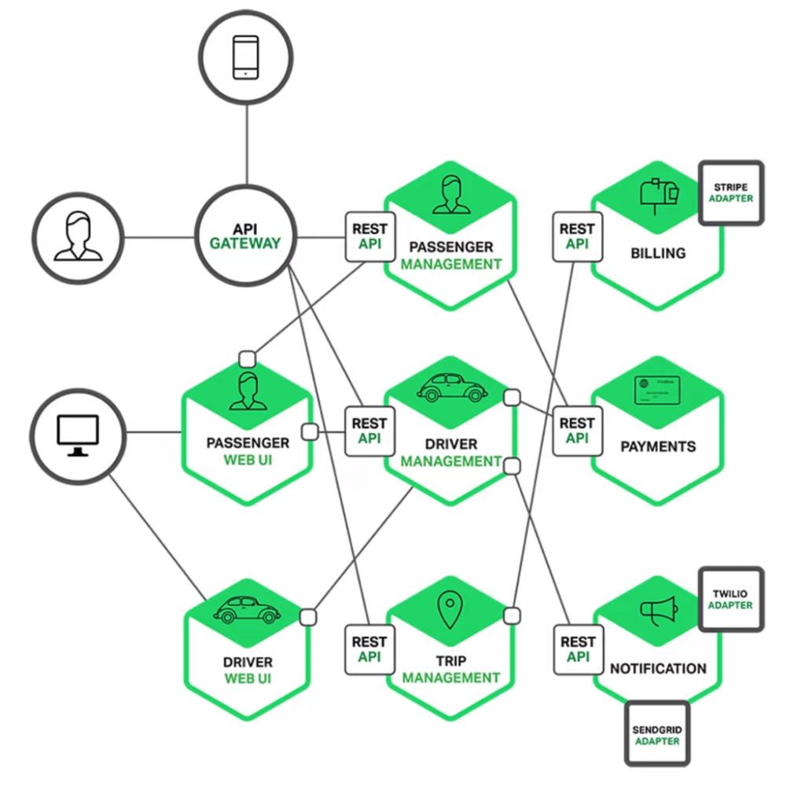

# Microservices

Монолит - одна кодовая база и одна точка запуска (входа)
Подходит для небольших проектов

Минусы:
- Сложно понять код если приложение разрослось
- Долгий билд, долгий деплой, долго поднимать локально
- Нельзя масштабировать отдельные модули системы
- Трудно обновлять/добавлять технологии

Решение - **микросервисная архитектура**.
Отдельные компоненты выносятся в отдельные маленькие приложения (микросервисы). 

**Плюсы**:
- Легче понять код отдельного сервиса
- Можно использовать разные технологии для разных сервисов
- Отдельные микросерисы можно масштабировать независимо друг от друга
- Отказ одного микросервиса не повлечет полный отказ всего приложения

Однако такой подход вызывает дополнительные **сложности**:
- Микросервисная архитектура работает поверх распределенной системы и работает через сеть, что привносит проблемы и особенности распределенных систем (CAP, партицирование схемы БД, распределенные транзакции)
- При большом количестве микросервисов и их связей система в общем может быть сложна для понимания
- Тестирование - протестировать систему целиком сложнее, чем монолот
- Сложно вносить изменения, которые затрагивают несколько микросервисов
- Для деплоя нужен кубер

## Микросервисные паттерны

- API Gateway
- Межсервисная коммуникация (HTTP, RPC, шина сообщений и тд)
- Service Discovery

## API Gateway

- Клиент работает только с API GATEWAY но не с отдельными микросервисами
- API Gateway обеспечивает безопасность всей системы, т.к. только он открыт во внешний мир

https://highload.today/api-gateway-endpoints/

## Межсервисная коммуникация

- REST-запросы (json)
- gRPC (Binary)
- Message Queue (RabbitMQ)

https://www.youtube.com/watch?v=Q3umCTPc7Qs&list=PLIB8be7sunXOruMj_zxiO9PGnM9TmZq58&ab_channel=SergeiCalabonga

## Service Discovery

