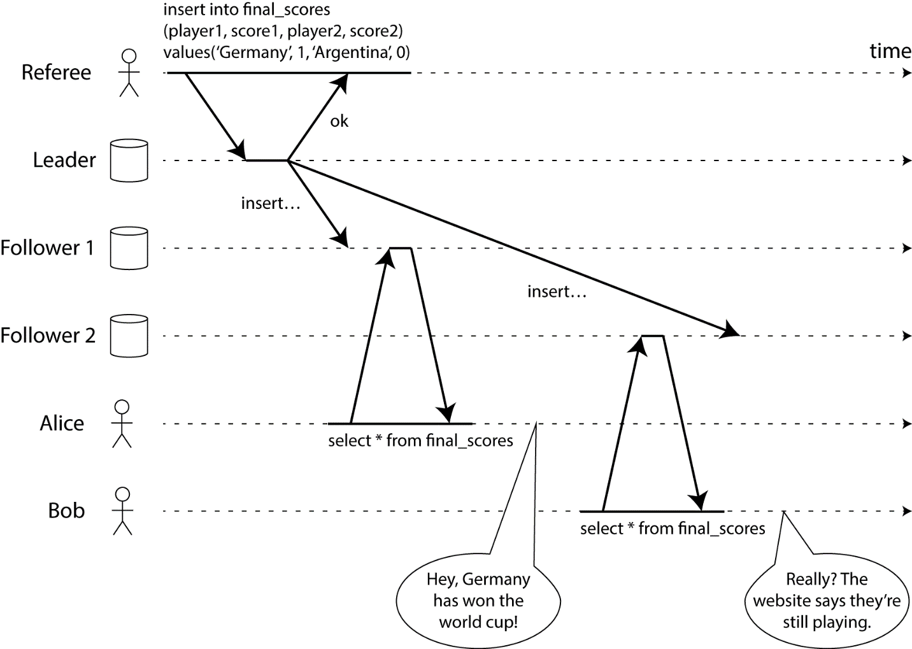

# Распределенные системы

- CAP theorem - C here is immediate consistency, not eventual

- eventual consistency
- consistent hashing

## Что такое распределенная система?

[https://ru.wikipedia.org/wiki/%D0%A0%D0%B0%D1%81%D0%BF%D1%80%D0%B5%D0%B4%D0%B5%D0%BB%D1%91%D0%BD%D0%BD%D0%B0%D1%8F_%D1%81%D0%B8%D1%81%D1%82%D0%B5%D0%BC%D0%B0](https://ru.wikipedia.org/wiki/%D0%A0%D0%B0%D1%81%D0%BF%D1%80%D0%B5%D0%B4%D0%B5%D0%BB%D1%91%D0%BD%D0%BD%D0%B0%D1%8F_%D1%81%D0%B8%D1%81%D1%82%D0%B5%D0%BC%D0%B0)

  

[https://habr.com/ru/company/piter/blog/262807/](https://habr.com/ru/company/piter/blog/262807/)

  

[https://habr.com/ru/post/322876/](https://habr.com/ru/post/322876/)

  

[https://en.wikipedia.org/wiki/Quorum_(distributed_computing)](https://en.wikipedia.org/wiki/Quorum_(distributed_computing))

  

[https://en.wikipedia.org/wiki/Fallacies_of_distributed_computing](https://en.wikipedia.org/wiki/Fallacies_of_distributed_computing)

## Что такое линеаризуемость?

[https://ru.wikipedia.org/wiki/%D0%9B%D0%B8%D0%BD%D0%B5%D0%B0%D1%80%D0%B8%D0%B7%D1%83%D0%B5%D0%BC%D0%BE%D1%81%D1%82%D1%8C](https://ru.wikipedia.org/wiki/%D0%9B%D0%B8%D0%BD%D0%B5%D0%B0%D1%80%D0%B8%D0%B7%D1%83%D0%B5%D0%BC%D0%BE%D1%81%D1%82%D1%8C)

  
  
  

## Что такое консистентность (непротиворечивость)?

[https://ru.wikipedia.org/wiki/%D0%9C%D0%BE%D0%B4%D0%B5%D0%BB%D1%8C_%D0%BA%D0%BE%D0%BD%D1%81%D0%B8%D1%81%D1%82%D0%B5%D0%BD%D1%82%D0%BD%D0%BE%D1%81%D1%82%D0%B8](https://ru.wikipedia.org/wiki/%D0%9C%D0%BE%D0%B4%D0%B5%D0%BB%D1%8C_%D0%BA%D0%BE%D0%BD%D1%81%D0%B8%D1%81%D1%82%D0%B5%D0%BD%D1%82%D0%BD%D0%BE%D1%81%D1%82%D0%B8)

  

[https://ru.wikipedia.org/wiki/%D0%A1%D0%BE%D0%B3%D0%BB%D0%B0%D1%81%D0%BE%D0%B2%D0%B0%D0%BD%D0%BD%D0%BE%D1%81%D1%82%D1%8C_%D0%B4%D0%B0%D0%BD%D0%BD%D1%8B%D1%85](https://ru.wikipedia.org/wiki/%D0%A1%D0%BE%D0%B3%D0%BB%D0%B0%D1%81%D0%BE%D0%B2%D0%B0%D0%BD%D0%BD%D0%BE%D1%81%D1%82%D1%8C_%D0%B4%D0%B0%D0%BD%D0%BD%D1%8B%D1%85)

## О чем гласит теорема CAP?

Теорема CAP гласит о том, что в распределенной системе достижимо только 2 из 3 следующих свойств:

-   Consistency: в данной теории означает линеаризуемость, т.е. данные непротиворечивы во всех узлах системы в любой момент времени;
    
-   Availability: 
    
-   Partition tolerance
    

  

Согласно этой теореме, распределенная система может характеризоваться как:

-   CP: данные консистентны, но доступность не может быть обеспечена. 
    
-   AP: данные неконсистентны, но доступны.
    

  
  
  

BASE-архтектура

  

[https://ru.wikipedia.org/wiki/%D0%A2%D0%B5%D0%BE%D1%80%D0%B5%D0%BC%D0%B0_CAP](https://ru.wikipedia.org/wiki/%D0%A2%D0%B5%D0%BE%D1%80%D0%B5%D0%BC%D0%B0_CAP)

  

[https://habr.com/ru/post/328792/](https://habr.com/ru/post/328792/)

  

[https://ru.wikipedia.org/wiki/Netsplit](https://ru.wikipedia.org/wiki/Netsplit)

[https://en.wikipedia.org/wiki/Split-brain_(computing)](https://en.wikipedia.org/wiki/Split-brain_(computing))

## Что такое теорема PACELC?

[https://ru.wikipedia.org/wiki/%D0%A2%D0%B5%D0%BE%D1%80%D0%B5%D0%BC%D0%B0_PACELC](https://ru.wikipedia.org/wiki/%D0%A2%D0%B5%D0%BE%D1%80%D0%B5%D0%BC%D0%B0_PACELC)

  
**

Распределенные системы

Что такое распределенная система?
https://ru.wikipedia.org/wiki/%D0%A0%D0%B0%D1%81%D0%BF%D1%80%D0%B5%D0%B4%D0%B5%D0%BB%D1%91%D0%BD%D0%BD%D0%B0%D1%8F_%D1%81%D0%B8%D1%81%D1%82%D0%B5%D0%BC%D0%B0

https://habr.com/ru/company/piter/blog/262807/

https://habr.com/ru/post/322876/

https://en.wikipedia.org/wiki/Quorum_(distributed_computing)

https://en.wikipedia.org/wiki/Fallacies_of_distributed_computing
Что такое линеаризуемость?
https://ru.wikipedia.org/wiki/%D0%9B%D0%B8%D0%BD%D0%B5%D0%B0%D1%80%D0%B8%D0%B7%D1%83%D0%B5%D0%BC%D0%BE%D1%81%D1%82%D1%8C

Что такое консистентность (непротиворечивость)?
https://ru.wikipedia.org/wiki/%D0%9C%D0%BE%D0%B4%D0%B5%D0%BB%D1%8C_%D0%BA%D0%BE%D0%BD%D1%81%D0%B8%D1%81%D1%82%D0%B5%D0%BD%D1%82%D0%BD%D0%BE%D1%81%D1%82%D0%B8

https://ru.wikipedia.org/wiki/%D0%A1%D0%BE%D0%B3%D0%BB%D0%B0%D1%81%D0%BE%D0%B2%D0%B0%D0%BD%D0%BD%D0%BE%D1%81%D1%82%D1%8C_%D0%B4%D0%B0%D0%BD%D0%BD%D1%8B%D1%85
О чем гласит теорема CAP?
Теорема CAP гласит о том, что в распределенной системе достижимо только 2 из 3 следующих свойств:
Consistency: в данной теории означает линеаризуемость, т.е. данные непротиворечивы во всех узлах системы в любой момент времени;
Availability: 
Partition tolerance

Согласно этой теореме, распределенная система может характеризоваться как:
CP: данные консистентны, но доступность не может быть обеспечена. 
AP: данные неконсистентны, но доступны.

BASE-архтектура

https://ru.wikipedia.org/wiki/%D0%A2%D0%B5%D0%BE%D1%80%D0%B5%D0%BC%D0%B0_CAP

https://habr.com/ru/post/328792/

https://ru.wikipedia.org/wiki/Netsplit
https://en.wikipedia.org/wiki/Split-brain_(computing)
Что такое теорема PACELC?
https://ru.wikipedia.org/wiki/%D0%A2%D0%B5%D0%BE%D1%80%D0%B5%D0%BC%D0%B0_PACELC

## Saga
- Применение на практике паттерн "Saga", или любого другого способа обеспечения транзакции данных в БД расположенных в разных сервисах.