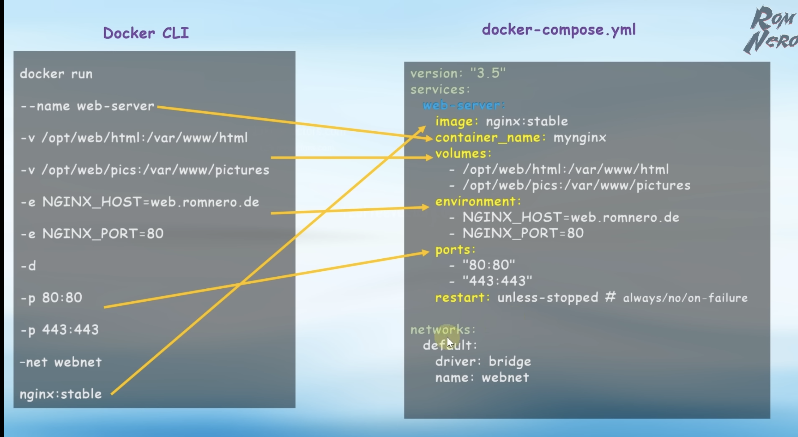

# Docker Compose

**Docker Compose** — декларативное описание нескольких контейнеров (stack) в одном `docker-compose.yml`.

Позволяет:

* поднимать несколько сервисов одной командой
* описывать сети, volume, env
* управлять зависимостями сервисов
* переиспользовать конфигурацию


**Best practices**
* не использовать container_name
* всегда фиксировать версии образов
* volume для данных БД
* depends_on + healthcheck
* отдельные файлы dev/prod
* .env для секретов




---

```yaml

services: # Главный раздел — список контейнеров, Каждый сервис = контейнер
    webserver:
        image: nginx:1.23                    # Использовать готовый образ
        container_name: app_webserver        # Явное имя контейнера (обычно не рекомендуется — ломает scaling)
        ports:
            - "8081:80"                      # host → container
        depends_on:
            - core-api-app                   # Гарантирует порядок запуска (не readiness)
            - one-login-app
        networks:
            default:
                aliases: #webserver is a main requests router so we need to specify hosts for communication
                    - api-core.app.local
                    - api-one-login.app.local
        volumes:
            - ./../api-core:/var/www/api-core    # bind mount
            - ./../one-login:/var/www/one-login
            - ./webserver/api.one-login.local.conf:/etc/nginx/conf.d/api.one-login.local.conf:ro
            - ./webserver/api.core.local.conf:/etc/nginx/conf.d/api.core.local.conf:ro

    core-api-app:
        build:     # Собрать образ локально
            context: .  # директория билда
            dockerfile: core-api-app/Dockerfile  # альтернативный Dockerfile
        container_name: app_core-api-app
        depends_on:
            - core-api-db
            - redis
        volumes:
            - ./../api_backoffice:/var/www
            - ./shared:/var/www/_shared
            - ./core-api-app/config/php.ini:/usr/local/etc/php/conf.d/custom.ini
            - ./core-api-app/xdebug:/tmp/xdebug
        environment:
            XDEBUG_MODE: 'debug'
            XDEBUG_CONFIG: 'client_host=host.docker.internal client_port=9003'
            PHP_IDE_CONFIG: 'serverName=api-core-docker'

    core-api-db:
        image: mysql:8.0.44
        container_name: app_core-api-db
        expose:
            - 3306
        env_file:
            - ./core-api-app/.env_db.docker
        ports:
            - 3316:3306
        volumes:
            - core-api-db_data:/var/lib/mysql            # named volume
            - ./core-api-db/my.cnf:/etc/mysql/conf.d/my.cnf:ro

volumes:
    core-api-db_data:
    one-login-db_data:
```

---

## command / entrypoint

Перезаписать CMD / ENTRYPOINT:
```yaml
entrypoint: ["php", "artisan"]   # перезаписываем ENTRYPOINT
command: ["migrate", "--force"]
```


## Environments

Есть 2 способа передать переменные окружения в сервис - `env_file` и в `environment`:
```yaml
env_file:
    - .env.app
environment:
    APP_ENV: local
    DB_HOST: db
```

Если какая-то переменная определена и в `env_file` и в `environment`, то более высокий приоритет у `environment`.
Переменные окружения из docker compose перепишут переменные из базового образа или Dockerfile. 


Конфликтуют ли environment и env_file?

```yaml
environment:
  NODE_ENV: production
  DB_HOST: db
```

Можно:

```yaml
environment:
  - NODE_ENV=production
```

---

### env_file

```yaml
env_file:
  - .env
```

Загрузить env из файла.


## .env поведение

Compose автоматически читает `.env` рядом с yaml.

Использование:

```yaml
image: myapp:${TAG}
```


------


## networks

Не нужен в большинстве случаев. Docker compose по умолчанию создает общую сеть для сервисов в которой каждый сервис может видеть друг друга.

```yaml
networks:
  backend:
    driver: bridge
```

Если нужно внести изменения в стандартный network, то можно обращаться к нему как к `default`:
```yaml
    networks:
      default:
        aliases:
          - api.core.local
          - api.one-login.local
```


---

---

### restart

```yaml
restart: always
```

Политика:

* `no`
* `always`
* `on-failure`
* `unless-stopped`

---

### healthcheck

```yaml
healthcheck:
  test: ["CMD", "curl", "-f", "http://localhost"]
  interval: 30s
  timeout: 5s
  retries: 3
```

### working_dir

```yaml
working_dir: /app
```

### user

```yaml
user: node
```
