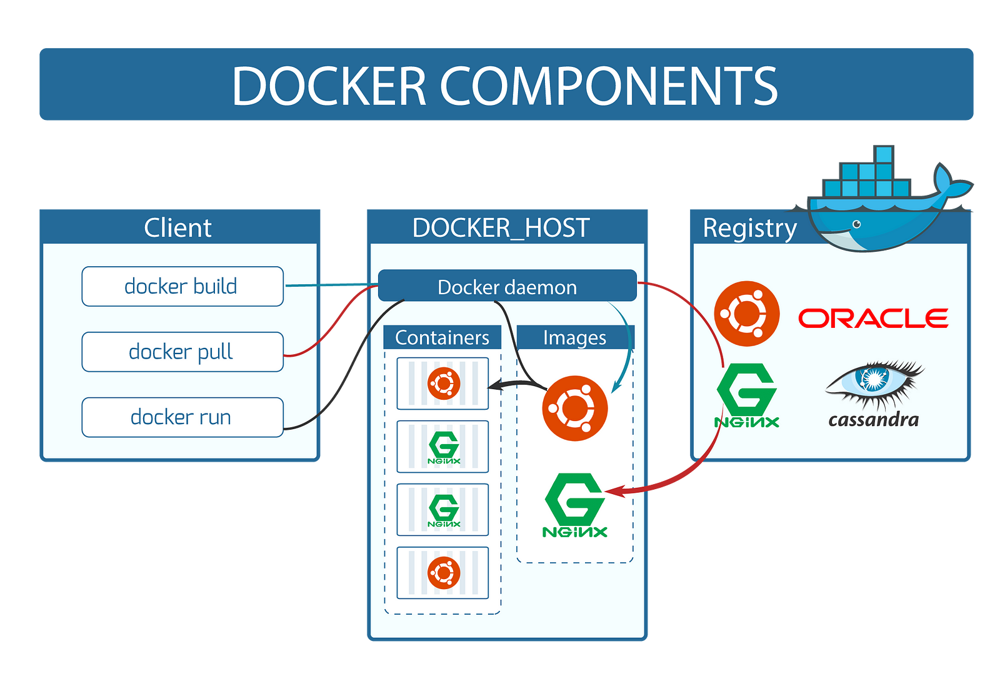
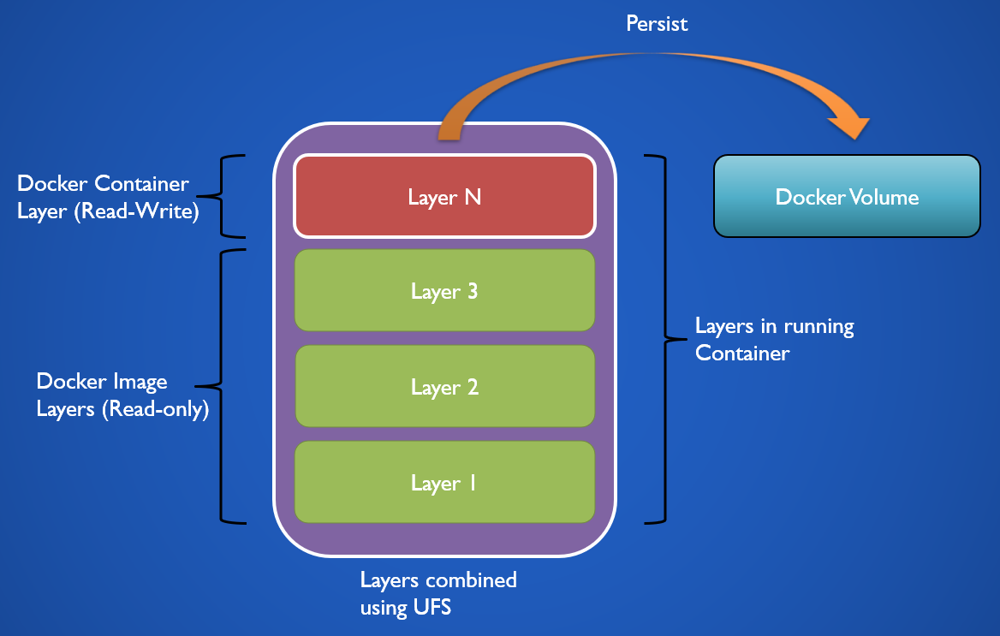

# Docker

**Docker** — средство упаковки (подготовка контейнера со средой, необходимой для приложения), доставки (Infrastructure-as-Code, IaC) и запуска (все приложения запускаются единым образом) приложения.

Docker появился в 2013 году как развитие технологии LXC и, благодаря своей простоте, популяризировал контейнеризацию.  

Сферы применения:
- Запуск приложения в изолированной подготовленной среде
- Доставка готового приложения с настроенной средой
- Деплой микросервисов (многоконтейнерные приложения)
- Быстрое развертывание и запуск сервисов/приложений для тестов

## Основные компоненты



**Docker** - клиент-серверное приложение. Его основные компоненты это **демон**, который занимается сборкой и запуском контейнеров, сами **контейнеры**, в которых исполняется приложение, и **образы** из которых создаются контейнеры.

Сами образы и контейнеры основаны на **OverlayFS** и представляют собой набор слоев.

- **Image** - подготовленный образ среды приложения, набор **read-only** слоев. На основе образа создаются контейнеры;
- **Container** - контейнер создается на основе образа, в контейнере происходит запуск приложения. Можно создать множество контейнеров на базе одного образа. По сути, контейнер это новый **read-write** слой поверх read-only слоев образа.



Готовые образы могут храниться локально или в **Repository**, которые находятся в **Registry**. **Registry** может быть приватным или публичным. 

Реестр, доступный по умолчанию в docker - https://hub.docker.com/search/?q=&type=image
В docker hub хранятся как официальные образы, например, https://hub.docker.com/_/nginx , так и пользовательские, как https://hub.docker.com/r/grafana/grafana .
Официальные образы отличаются тем, что создаются в сотрудничестве с Docker, Inc. и соответствуют высоким стандартам качества и хорошо подходят для продакшена.

**Repository** в экосистеме докер это набор образов с разными тегами. Например, https://hub.docker.com/_/php, официальный репозиторий php в registry docker hub. В репозитории доступны различные образы с таким тегами как `8.2-fpm`, `7.3-fpm-alpine`, `zts-bullseye` и т.д.

## Основные принципы при работе с Docker

1. **Один процесс на контейнер**. Каждый контейнер должен запускать один основной процесс;
2. **Использование Volumes для хранения данных**. Хотя хранить данные и возможно на слое контейнера, но это является плохой практикой, т.к. при обновлении образа будет невозможно использовать данные из контейнера предыдущей версии. Все данные приложения нужно хранить посредствам `volumes`;
3. **Логирование и Мониторинг**. Лучшей практикой логирования является использование `STDOUT/STDERR` основного процесса вместо хранения файловых логов;
4. **Избегание использования root**. Для обеспечения безопасности, основной процесс в контейнере должен быть запущен из под пользователя, который имеет только необходимый набор прав;
5. **Минимизация образов**. В образе должны быть только необходимые для работы приложения зависимости. Инструменты для дебага и SDK для билда проекта не должны быть включены в конечный образ;
6. **Использование официальных образов**. По возможности следует использовать официальные образы, т.к. они максимально безопасны и оптимизированы.

## Registry и Repositories

**Registry** — хранилище образов (Docker Hub, GitHub Container Registry, приватные registry).

**Repository** — набор образов с разными тегами в registry. Например, `nginx` — это репозиторий, а `nginx:1.23`, `nginx:alpine` — это образы с разными тегами.

```sh
docker pull nginx:1.15.1           # Скачать образ из registry
docker push username/project-name   # Отправить образ в registry (docker hub или собственный)
docker login                        # Войти в registry
docker logout                       # Выйти из registry
```

**Docker Hub** — публичный registry по умолчанию: https://hub.docker.com

## Images

**Image** — неизменяемый шаблон для создания контейнеров. Состоит из слоев (layers), каждый слой — это изменение файловой системы.

Корневым образом в Docker является `scratch` (пустой user space, доступны только syscalls), однако большинство образов основано на официальных образах из Docker Hub.

```sh
docker images                      # Список локальных образов
docker images -a                   # Все образы (включая intermediate)
docker images -aq                  # Только ID образов

docker build -t my_image:0.01 .    # Собрать образ из Dockerfile
docker tag [image_id] my_image:0.01  # Добавить тег к образу
docker pull nginx:1.23            # Скачать образ из registry
docker push username/image:tag   # Отправить образ в registry

docker rmi [image_id]             # Удалить образ по id или repository:tag
docker rmi -f $(docker images -aq) # Удалить все образы (force)

docker history image-name          # История слоев образа
docker inspect image-name          # Подробная информация об образе
```

## Containers

**Container** — запущенный экземпляр образа. Контейнер создается на основе образа и имеет свой собственный read-write слой поверх read-only слоев образа.

Контейнеры создаются на основе образов с помощью команды `docker create` / `docker run`.

**Важно:** Контейнер создается с неизменяемой конфигурацией (ports, volumes, env). После создания изменить их нельзя — нужно пересоздать контейнер.

При создании контейнера необходимо указать команду, которая будет основным процессом приложения. Команда может быть указана в `Dockerfile` (CMD/ENTRYPOINT) или явно при создании контейнера.

```sh
docker create image-name [COMMAND]  # Создать контейнер (не запускать)
docker start container-name         # Запустить существующий контейнер
docker run image-name [COMMAND]     # Создать и запустить контейнер
docker stop container-name          # Остановить контейнер
docker kill container-name          # Принудительно остановить (SIGKILL)
docker rm container-name            # Удалить контейнер
docker ps                           # Список запущенных контейнеров
docker ps -a                        # Список всех контейнеров
```

## Volumes

```shell
docker volume ls
docker volume inspect docker_db_data
docker volume create db_data
docker volume rm db_data
```

**Типы volumes:**

1. **Bind mount** — монтирование директории хоста в контейнер:
```shell
docker run -v /host/datadir:/var/lib/mysql:ro mysql
```
Прямое монтирование директории хоста. Изменения видны и на хосте, и в контейнере.

2. **Anonymous volume** — автоматически создаваемый Docker том:
```shell
docker run -v /var/lib/mysql mysql
```
Docker создает том автоматически, хранится в `/var/lib/docker/volumes/HASH/_data`. Удаляется при удалении контейнера с флагом `-v`.

3. **Named volume** — именованный том, управляемый Docker:
```shell
docker run -v mysql_data:/var/lib/mysql mysql
```
Docker создает и управляет томом, хранится в `/var/lib/docker/volumes/mysql_data/_data`. Сохраняется после удаления контейнера.

**Управление volumes:**
```shell
docker volume ls                    # Список volumes
docker volume create volume-name    # Создать volume
docker volume inspect volume-name   # Информация о volume
docker volume rm volume-name        # Удалить volume
docker volume prune                # Удалить неиспользуемые volumes
```

## Network

Docker создает изолированные сети для контейнеров. По умолчанию контейнеры могут общаться с интернетом, но не друг с другом.

```shell
docker network ls                    # Список сетей
docker network create mynetwork      # Создать сеть
docker network inspect mynetwork     # Информация о сети
docker network rm mynetwork         # Удалить сеть
docker network prune                # Удалить неиспользуемые сети

docker run --network mynetwork nginx # Запустить контейнер в сети
docker network connect mynetwork container  # Подключить контейнер к сети
docker network disconnect mynetwork container  # Отключить контейнер от сети
```

**Типы сетей:**

1. **Bridge** (по умолчанию) — изолированная сеть:
   - В дефолтной сети контейнеры общаются по IP
   - В именованной сети контейнеры общаются по именам
   - Контейнеры в разных сетях могут общаться по IP

2. **Host** — использует сеть хоста (только Linux):
   - Контейнер использует сетевой стек хоста напрямую
   - Нельзя создать несколько сетей типа host

3. **None** — отключенная сеть:
   - Контейнер изолирован от сети
   - Нельзя создать новую сеть с драйвером none

4. **Macvlan** — назначает MAC-адрес контейнеру:
   - Контейнер выглядит как физическое устройство в сети

**Отладка сети:**

Вместо установки инструментов в продакшен-контейнер, можно создать отдельный контейнер для отладки:

```sh
docker run --rm -it --net container:nginx alpine
# Теперь можно использовать tcpdump, netstat и т.д.
```

## Dockerfile

Dockerfile — инструкции для сборки образа.

```shell
docker build .                      # Собрать образ из Dockerfile (без тега, будет <none>)
docker build -t myimage:0.01 .     # Собрать образ с тегом
docker build -f Dockerfile.prod .  # Указать другой Dockerfile
docker build --no-cache .          # Собрать без использования кеша
docker build --target stage .      # Собрать до определенного stage (multi-stage)
```

## Cache и слои

Docker основан на **OverlayFS** — файловая система, доступная в Linux. Каждая инструкция в Dockerfile создает новый слой.

**Кеширование слоев:**
- Docker кеширует слои для ускорения сборки
- Если слой не изменился, используется кеш
- Изменение одного слоя инвалидирует все последующие

**Best practices для кеша:**
- Объединять `apt-get update` и `apt-get install` в один RUN
- Копировать файлы зависимостей (package.json, requirements.txt) перед копированием кода
- Очищать кеш пакетного менеджера в том же слое

**Пример:**
```dockerfile
# Плохо (кеш может быть устаревшим)
RUN apt-get update
RUN apt-get install -y nginx

# Хорошо
RUN apt-get update && \
    apt-get install -y nginx && \
    apt-get clean && \
    rm -rf /var/lib/apt/lists/*
```


## Multistage build

Для компилируемых языков/проектов не нужно включать инструменты сборки в продакшен-образ. Для этого используется multi-stage build:

1. Проект собирается в отдельном stage с инструментами сборки
2. Копируется собранный проект в минимальный продакшен-образ

Это значительно уменьшает размер финального образа.

**Пример:**
```dockerfile
# Stage 1: Build
FROM node:18 AS builder
WORKDIR /app
COPY package*.json ./
RUN npm install
COPY . .
RUN npm run build

# Stage 2: Production
FROM node:18-alpine
WORKDIR /app
COPY --from=builder /app/dist ./dist
COPY package*.json ./
RUN npm install --production
CMD ["node", "dist/index.js"]
```

**Использование конкретного stage:**
```sh
docker build --target=builder -t myapp:builder .
```


## Links

- https://hub.docker.com/search/?q=&type=image - Docker hub
- https://www.youtube.com/watch?v=O8N1lvkIjig - docker с 0% до 100%
- https://www.youtube.com/watch?v=Dx8WOurCCaM - best practices по описанию dockerfile
- https://docs.docker.com/develop/develop-images/dockerfile_best-practices/ - best practices по описанию dockerfile
- https://docs.docker.com/develop/dev-best-practices/ - docker development best practices
