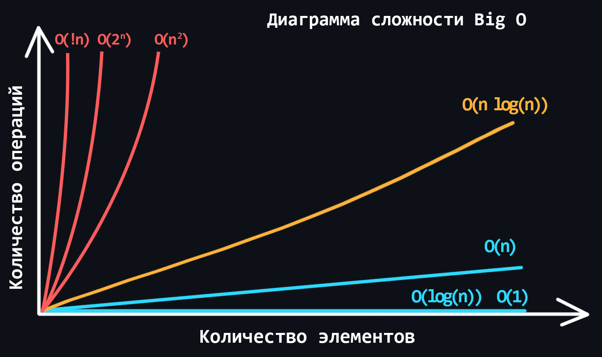
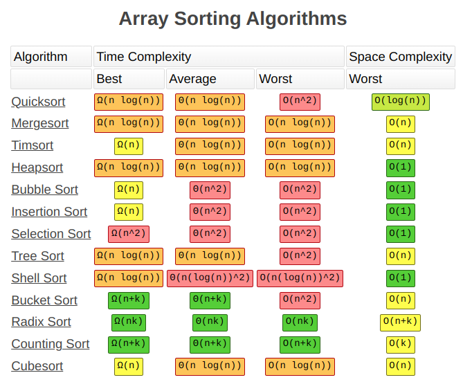
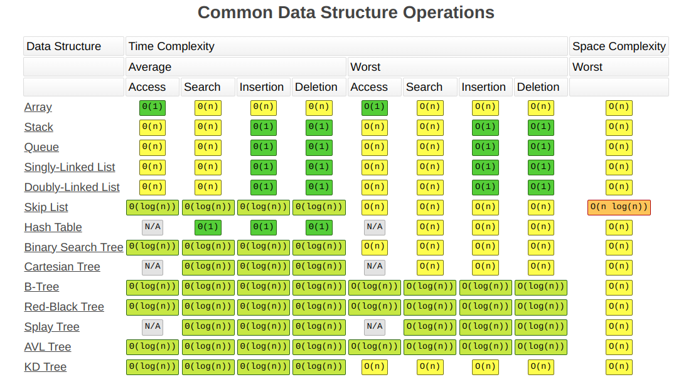

# Big O notation

Big O — обозначение способа приблизительной оценки производительности алгоритмов для относительного сравнения. 

Big O показывает верхнюю границу зависимости между входными параметрами функции и количеством операций, которые выполнит процессор.

Разновидности сложности алгоритмов:
- Константная - O(1)
- Линейная - O(n)
- Логарифмическая - O(log n)
- Линеарифметическая - O(n * log n)
- Квадратичная - O(n^2)
- Степенная - О(2^n)
- Факториальная - O(!n)



```
           N = 5            10             20             30
-----------------------------------------------------------------------
O(1)           1            1              1              1
O(log N)       2.3219...    3.3219...      4.3219...      4.9068...
O(N)           5            10             20             30
O(N log N)     11.609...    33.219...      84.638...      147.204...
O(N ^ 2)       25           100            400            900
O(2 ^ N)       32           1024           1,048,576      1,073,741,824
O(N!)          120          3,628,800      2,432,902,0... 265,252,859,812,191,058,636,308,480,000,000
```

Оценку производят по двум основным величинам:
- **Время выполнения** - количество операций на множестве данных
- **Объем памяти** - количество памяти необходимое алгоритму для обработы множества данных. Этот способ оценки **редко применяется**, т.к. память некритичный ресурс в наши дни

Также алгоритм может иметь разную **"среднюю"** сложность и сложность **"в самом худшем случае"**. В таких случаях применяют следующую нотацию:
- **O** - сложность в худшем случае
- **Θ** (тета) - средняя сложность
- **Ω** (омега большое) - сложность в лучшем случае




## Сложность операций над структурами данных

Для разных структур данных оценка будет производится по разным операциям для этих структур (**Access, Search, Inserting, Deleting**) и будет различаться:



## Константная - O(1)

Сложность алгоритма не зависит от входных данных.
Только одна операция для любых входных данных.

Пример - получение первого элемента массива

```php
$arr = [1,2,3,4,5];  
$result = $arr[0];
```

## Линейная - O(n)

Количество операций линейно растет с увеличением входных данных
Типичный признак - цикл, рекурсия

```php
function sum(array $arr): int
{
    $sum = 0;
    foreach ($arr as $item) {
        $sum += $item;
    }

    return $sum;
}
```


## Логарифмическая - O(log n)

Алгоритмы типа "Разделяй и властвуй" (Divide and Conquer), например, бинарный поиск

TODO

## Линеарифметическая или линеаризованная - O(n * log n)

Итерации, которые используют Divide and Conquer


## Квадратичная - O(n^2)

Вложенные циклы по той же коллекции


## Links
- Краткое описание сложности алгоритмов c примерами https://bimlibik.github.io/posts/complexity-of-algorithms/
- Шпаргалка по сложности разных алгоритмов и структур данных на разных операциях - https://www.bigocheatsheet.com/
- Шпаргалка по сложности для разных алгоритмов https://habr.com/ru/post/188010/
