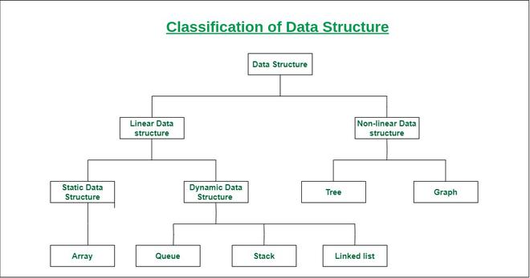
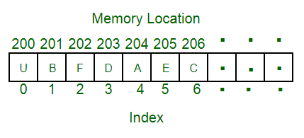
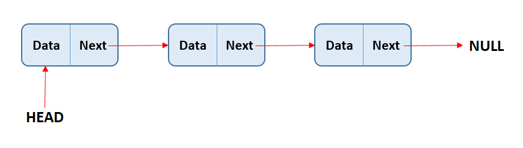

# Data Structures

Структуры данных - структуры которые хранят и организовывают данные таким образом, чтобы эффективно (по памяти и времени выполнения) обеспечивать доступ к данным.

Разные структуры лучше подходят для разных задач, т.к. разные структуры используют разные способы хранения данных и используют разные алгоритмы для доступа к ним.

## Array

Линейная структура данных с фиксированным количеством элементов одного типа.
Позволяет легко получить доступ к элементу по индексу (константная сложность). 
Для остальных операций сложность линейная (для поиска надо перебрать все элементы, для добавления/удаления нужно переиндексировать массив -> т.е. сделать копию нового размера).

**Особенности:**
- Элементы лежат в памяти последовательно, хранится в стеке
- Статическая структура - невозможно изменить размер
- Быстрый доступ к элементам по индексу **О(1)**
- Часто элементы массива держат отсортированными

## Linked list

Линейная структура данных, которая представляет список связанных элементов. Каждый элемент представлен нодой, которая содержит данные элемента и ссылку на следующий элемент. Последний элемент (TAIL) содержит ссылку на NULL.

Бывают **односвязанными** (ссылка только только на next), **двухсвязанными** (ссылка на next и previous), и замкнутыми (TAIL содержит ссылку на HEAD)

**Операции**:
- insert/delete

**Особенности:**
- В отличии от массива длина динамическая
- Быстрая вставка/удаление элементов **О(1)** по **индексу** (но чтобы его узнать нужно сделать O(n) поиск элемента)

## Hash-table

Структура, которая позволяет хранить данные в формате ключ => значение.

## Деревья

https://www.youtube.com/watch?v=0BUX_PotA4c&ab_channel=AlekOS

деревья позволяют держать элементы упорядочеными при вставке
двоичное дерево поиска - позволяет быстро производить поиск и вставку - логарифмическая сложность
если данные всегда будут вставляться в определенном отсортированном порядке, то получится, что все элементы выстроятся или слева или справа и получится связанный список и тогда сложность возрастает до линейной - дерево несбалансированно

Проверка сбалансированности дерева - перегрузка дерева.

АВЛ дерево позволяет держать дерево сбалансированным и тогда сложность будет снова логарифмическая
Однако в нем очень много рекурсивных функций и поворотов, что делает его медленным при вставке новых элементов

Красно-черное дерево работает быстрее при вставке новых элементов, но все равно медленнее при поиске чем АВЛ. Это один из лучших алгоритмов над которым бились ученые 40 лет
