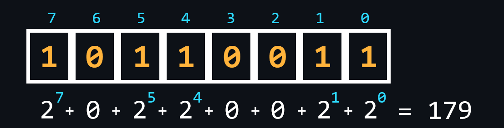
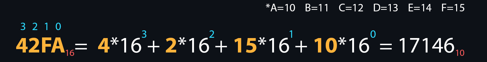

# Numeral systems

Система счисления представляет собой совокупность символов и правил для обозначения чисел. В информатике принято выделять четыре основных системы счисления: двоичная, восьмеричная, десятичная, шестнадцатеричная. Связано это, в первую очередь, с их использованием в различных отраслях программирования.

## Двоичная (binary)

Логика процессора основана на двоичной системе счисления

## Восьмиричная (octal)

Используется, например, в Linux-системах для выдачи прав доступа.

## Шестнадцатеричная (hex)

Для записи используются дополнительно буквы: A, B, C, D, E, F. Широко используется в низкоуровневом программировании и компьютерной документации из-за, того что минимальной адресуемой единицей памяти является 8-битный байт, значения которого удобно записывать двумя шестнадцатеричными цифрами.

Также такая запись удобнее, чем двоичная форма, т.к. занимает меньше места

## Links
- Перевод из одной системы в другую https://yurace.pro/NSConverter/
- Полный гайд по системам счисления https://guides.hexlet.io/ru/numeral-systems/
